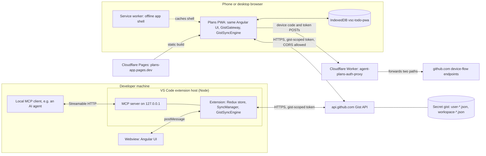
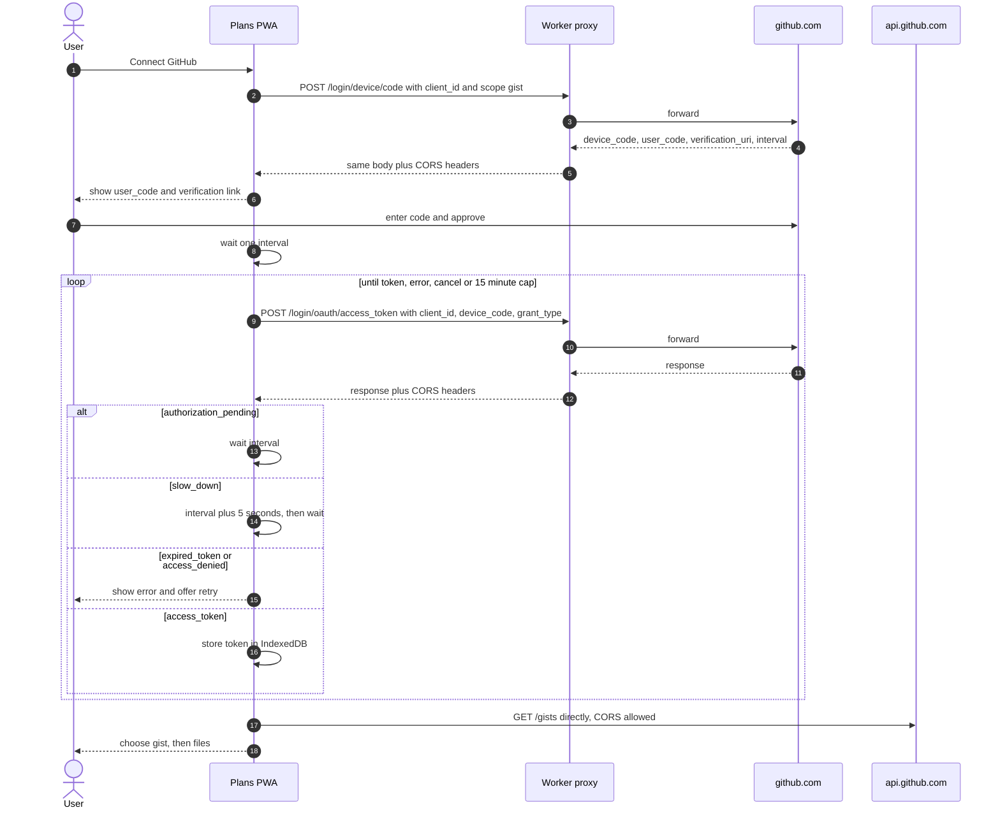
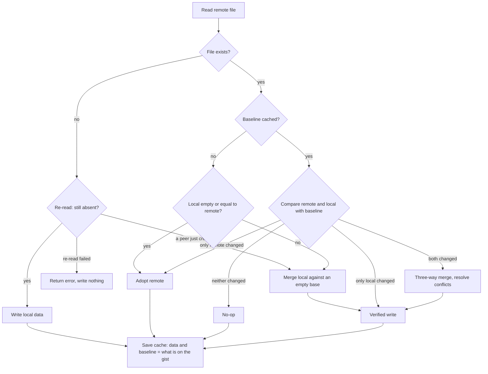
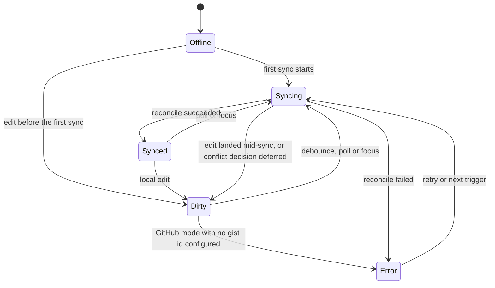

# Architecture

How VS Code Todo and its mobile companion, Plans, fit together, and why they are built this way.
Components link to their source. A reason not recorded in code, commits or by the maintainer is
marked *(inferred)*.

**Contents**

1. [TL;DR](#1-tldr)
2. [System context](#2-system-context)
3. [Names](#3-names)
4. [Repository layout](#4-repository-layout)
5. [Extension host](#5-extension-host)
6. [Webview and host messaging](#6-webview-and-host-messaging)
7. [One Angular app, two builds](#7-one-angular-app-two-builds)
8. [The PWA](#8-the-pwa)
9. [Authentication](#9-authentication)
10. [The Cloudflare Worker](#10-the-cloudflare-worker)
11. [Gist sync](#11-gist-sync)
12. [Three-way merge](#12-three-way-merge)
13. [The drift incident](#13-the-drift-incident)
14. [MCP server](#14-mcp-server)
15. [Testing and CI](#15-testing-and-ci)
16. [Deployment](#16-deployment)
17. [Key decisions](#17-key-decisions)
18. [Known limitations and what changes at scale](#18-known-limitations-and-what-changes-at-scale)

---

## 1. TL;DR

- **VS Code Todo** is a todo and notes extension for VS Code and editors that install from Open VSX. **Plans** is a PWA that opens the same lists on a phone.
- Three deployables: the extension (VS Code Marketplace, Open VSX), the PWA (Cloudflare Pages), and a CORS-only auth proxy (Cloudflare Workers).
- There is no application server. The two apps are peers that read and write one secret GitHub Gist.
- They agree because both run the same sync engine and three-way merge from [`packages/core`](packages/core/src/index.ts).

## 2. System context

Each surface talks only to what it needs. The PWA uses the Worker only to sign in; both apps call the gist API directly.



The extension signs in through VS Code's built-in GitHub authentication, which the diagram omits.

## 3. Names

| Name | Refers to |
| --- | --- |
| VS Code Todo | Extension display name ([`package.json`](package.json)) |
| `vsc-todo` | Extension package name. Marketplace id `FrancescoAnzalone.vsc-todo`; command prefix `vsc-todo.*`; settings live under `vscodeTodo.*` |
| Plans / Agent Plans | PWA short name and tab title / full manifest name ([`manifest.webmanifest`](webview-ui/src/manifest.webmanifest)) |
| `plans-app` | Cloudflare Pages project, `plans-app.pages.dev` |
| `agent-plans-auth-proxy` | Cloudflare Worker ([`wrangler.toml`](worker/wrangler.toml)) |
| `@vsc-todo/core` | Shared package in `packages/core` |
| `vscode-todo` | GitHub repository `ai-autocoder/vscode-todo` |
| `VS Code Todo Sync` | Description stamped on gists either app creates |
| `vsc-todo-pwa` | The PWA's IndexedDB database |
| `vscode-todo-mcp` | Server name the MCP server reports |
| `hello-world`, `HelloWorldPanel` | Template leftovers: the webview's npm package and Angular project name; the editor-tab panel class |

## 4. Repository layout

The repo is organized by where code runs.

| Directory | Contents | Ships as |
| --- | --- | --- |
| [`src/`](src/extension.ts) | Extension host, TypeScript compiled to CommonJS | VSIX (`out/src/**`) |
| [`webview-ui/`](webview-ui/angular.json) | One Angular 21 app, two shipped builds (plus a dev configuration) | Inside the VSIX, and on Cloudflare Pages |
| [`packages/core/`](packages/core/src/index.ts) | Model, merge, sync engine, GitHub clients, IndexedDB stores; no runtime dependencies | Never published; compiled into both apps |
| [`worker/`](worker/src/index.ts) | Device-flow CORS proxy | Cloudflare Workers |

**How core reaches each app.** Both apps compile it from source:

- **Extension:** the root [`tsconfig.json`](tsconfig.json) compiles `packages/core/src/**` next to `src/**`. Extension code imports it through one file, [`src/core.ts`](src/core.ts) (`export * from "../packages/core/src/index"`). Two source roots make tsc emit `out/src/**`, hence `main` is `./out/src/extension.js`.
- **Webview and PWA:** [`webview-ui/tsconfig.json`](webview-ui/tsconfig.json) maps `@vsc-todo/core` to the source, and Angular's esbuild bundler follows the mapping.

**Why no `paths` alias in the extension.** Core is ESM with bundler-style resolution. `paths` only affects type checking, so tsc would emit `require("@vsc-todo/core")`, which Node cannot resolve. The extension would type-check and then fail on activation. A relative import compiles to a `require` of a file that exists in `out/`.

## 5. Extension host

On the desktop the extension host owns all data. The webview only renders it and sends commands.

**Activation.** [`extension.ts`](src/extension.ts) runs on `onStartupFinished`. It:

- creates the store and [`StorageSyncManager`](src/storage/StorageSyncManager.ts);
- wires up GitHub auth, [`SyncManager`](src/sync/SyncManager.ts) and the [MCP host](src/mcp/McpServerHost.ts);
- loads stored lists;
- registers the sidebar view ([`TodoViewProvider`](src/panels/TodoViewProvider.ts)) and the editor-tab panel ([`HelloWorldPanel`](src/panels/HelloWorldPanel.ts)).

**Store.** [`store.ts`](src/todo/store.ts) holds five Redux Toolkit slices. `user` and `workspace` share one reducer object; `currentFile` reuses it, overrides `loadData` with its own payload shape, and adds `pinFile`.

| Slice | Holds |
| --- | --- |
| `user` | Todos for the VS Code profile |
| `workspace` | Todos for the open folder |
| `currentFile` | Todos for the active editor's file, plus `filePath`, `isPinned` |
| `editorFocusAndRecords` | Focused path, files that have todos, path aliases |
| `actionTracker` | Which slice the last action touched |

**Change pipeline.** A middleware records the slice each action touched. The single `store.subscribe` then updates both webviews and the status bar, persists the slice, and in GitHub mode schedules a push.

`loadData` and `pinFile` still schedule a push but do not mark the scope dirty. Tab switches and remote pulls dispatch `loadData`; treating them as edits would show "unsynced" on every file click.

**Scopes.**

- **User** lists belong to the profile.
- **Workspace** lists belong to the open folder.
- **Per-file** lists live in the workspace's `filesData` map, keyed by absolute path.

Machines disagree on absolute paths, so `filesDataPaths` stores absolute and workspace-relative aliases, and matching uses both ([`todoUtils.ts`](src/todo/todoUtils.ts)). [`editorHandler.ts`](src/editorHandler.ts) follows the active editor; file rename and delete events move or drop a file's list.

**Persistence and sync modes.**

| Scope | Mode | Data lives in |
| --- | --- | --- |
| User | Local (default) | `globalState.TodoData` plus `globalData.json` in extension storage |
| User | Profile Sync | The same storage, registered with `globalState.setKeysForSync(["TodoData"])` |
| User | GitHub Gist | Memento cache `gistCache_global_<file>`, reconciled with the gist |
| Workspace, per-file | Local | `workspaceState` plus `workspaceData.json` |
| Workspace, per-file | GitHub Gist | Memento cache `gistCache_workspace_<file>`, reconciled with the gist |

- **Multiple windows.** A file watcher on the JSON files keeps several VS Code windows in step (commit f2d64a7).
- **Mode is internal state, not a setting.** The mode is stored as `syncMode` and set only through commands that first connect GitHub and configure a gist ([`SyncCommands.ts`](src/sync/SyncCommands.ts)). A setting could switch a scope to GitHub mode with neither in place.
- **Gist cache is local truth.** In GitHub mode the gist cache is the local source of truth; per-file lists exist nowhere else.

The status bar ([`statusBarItem.ts`](src/statusBarItem.ts)) shows counts for all three scopes. It adds a sync glyph only for error, syncing or dirty.

## 6. Webview and host messaging

The UI never touches storage or the network. It sends commands and renders the state the host sends back.

**Contract.** [`src/panels/message.ts`](src/panels/message.ts) defines 31 webview→host commands and 7 host→webview messages, including `reloadWebview` (full state and config) and `syncTodoData` (one slice). Payload types derive from the Redux action creators, and the webview imports the file directly, so changing a reducer's signature is a compile error in the UI.

**Flow.** The webview sends `webview-ready` and receives `reloadWebview`. After that, every edit goes UI → command → Redux action → subscriber → `syncTodoData`. The UI holds no authoritative state.

**CSP.** Both surfaces serve `default-src 'none'; style-src <webview source> 'unsafe-inline'; script-src 'nonce-…'`. Local resources are limited to `out/` and the webview build ([`TodoViewProvider.ts`](src/panels/TodoViewProvider.ts)).

The policy has no `connect-src`, so the webview cannot `fetch`. GitHub traffic comes from the Node host, where CORS does not apply, and the token stays in the host's SecretStorage.

## 7. One Angular app, two builds

The PWA is not a second UI. It is the webview built with a different configuration, plus a bridge that replaces the extension host.

| | Extension build | PWA build (`pwa` configuration in [`angular.json`](webview-ui/angular.json)) |
| --- | --- | --- |
| Index | `index.html` → `<app-root>` | [`index.pwa.html`](webview-ui/src/index.pwa.html) → `<app-pwa-shell>` |
| Environment | `environment.prod.ts` (`pwa: false`), swapped by the `production` configuration | [`environment.pwa.ts`](webview-ui/src/environments/environment.pwa.ts): client id, proxy URL |
| Bootstrap | [`bootstrap.ts`](webview-ui/src/bootstrap.ts) → `AppModule` | [`bootstrap.pwa.ts`](webview-ui/src/bootstrap.pwa.ts) → `PwaAppModule` |
| Data provider | [`data.providers.ts`](webview-ui/src/app/data/data.providers.ts) → `VsCodeGateway` | [`data.providers.pwa.ts`](webview-ui/src/app/data/data.providers.pwa.ts) → `GistGateway` |
| Extra stylesheet | none | [`vscode-theme.css`](webview-ui/src/pwa/vscode-theme.css) |
| Service worker, manifest, Pages headers | no | yes |
| Output hashing | none, because the `build` script passes `--output-hashing=none`, so the host loads `main.js` and friends by name | all |

**How the unmodified UI talks to a gist.** The seam is the message protocol:

1. The UI's `TodoService` posts through [`vscode.ts`](webview-ui/src/app/utilities/vscode.ts). Outside VS Code there is no `acquireVsCodeApi`, so the wrapper calls an installed delegate.
2. [`PwaShellComponent`](webview-ui/src/app/pwa/pwa-shell.component.ts) installs that delegate, which routes each message through [`message-dispatcher.ts`](webview-ui/src/app/data/message-dispatcher.ts) to [`GistGateway`](webview-ui/src/app/data/gist-gateway.ts).
3. The gateway emits the host's message shapes, and the shell re-posts them with `window.postMessage`. `TodoService` handles them as if the extension had sent them.

[`DataGateway`](webview-ui/src/app/data/data-gateway.ts) types each command as `Parameters<typeof messagesFromWebview.X>`, holding both gateways to the extension's contract. Only the PWA injects it today. In the extension build, `VsCodeGateway` is registered but never constructed; moving `TodoService` onto it is recorded as deferred.

**Why a build-time swap.** A runtime `if` with a dynamic `import()` would make esbuild split the bundle. The webview CSP allows scripts by nonce only, and imported chunks don't inherit the nonce ([`bootstrap.ts`](webview-ui/src/bootstrap.ts)).

A side effect is that no gist, device-flow or IndexedDB code reaches the extension. A fresh extension build contains none of `login/device/code`, `agent-plans-auth-proxy`, `vsc-todo-pwa` or `api.github.com`.

**Shared by default.** Only `src/pwa/**`, `src/app/pwa/**`, `*.pwa.*` files and the gateway/dispatcher they alone reach are PWA-only. Any other edit changes both surfaces, and the extension half ships only with the next Marketplace release.

## 8. The PWA

Plans is a static site. All state lives on the device and in the gist, so hosting is a CDN.

**Installability.** Three pieces, all included only in the PWA build:

- **Manifest.** [`manifest.webmanifest`](webview-ui/src/manifest.webmanifest) declares a standalone portrait app with maskable icons.
- **Service worker.** Angular's service worker is registered only in the PWA production build ([`app.module.ts`](webview-ui/src/app/app.module.ts)). [`ngsw-config.json`](webview-ui/ngsw-config.json) prefetches the app shell and defines no data groups: API responses are never cached, and offline data comes from IndexedDB.
- **Headers.** [`_headers`](webview-ui/src/_headers) serves the service worker, manifest and `index.html` with `no-cache`, so no client is pinned to an old build.

**IndexedDB** (database `vsc-todo-pwa`). Each store opens the database unversioned and bumps the version if its own store is missing, so stores are added independently ([`indexedDb.ts`](packages/core/src/indexedDb.ts), commit b3e1b89).

| Store | Contents |
| --- | --- |
| `sync-cache` | One sync cache per gist file (§11) ([`indexedDbStores.ts`](packages/core/src/indexedDbStores.ts)) |
| `auth` | Token, gist id, chosen file names |
| `conflicts` | Pending conflict reviews, at most 50 ([`pending-conflicts.store.ts`](webview-ui/src/app/pwa/conflicts/pending-conflicts.store.ts)) |
| `preferences` | Wide View, Show Tags |

**Session restore.** `GistGateway.restoreSession()` reloads the lists from the sync cache before any reconcile can run. Previously the app started with an empty list against a populated baseline, read that as "the user deleted everything", and pushed it (commit 359034e). With a token, gist and file stored, the app reaches "connected" without a network call.

The user always chooses the gist, and both a user and a workspace file are required, because the PWA has no local-only mode. Edits run through `todoMutations` ([`todoReducers.ts`](packages/core/src/todoReducers.ts)), the framework-agnostic port of the extension's reducers.

**Touch layout.** [`vscode-theme.css`](webview-ui/src/pwa/vscode-theme.css) supplies the `--vscode-*` variables VS Code would inject. It puts every mobile rule (48 px targets, larger text, visible row actions) under `@media (pointer: coarse)`, keyed to the pointer rather than the width, so a phone in landscape still gets touch targets.

**Deploy.** `npm run deploy:pwa` clears the build directory both targets share, builds, and uploads with `--branch main` (§16).

## 9. Authentication

Both apps need a token with the `gist` scope. They get it differently: one runs inside VS Code, the other is a public web page.

| | Extension | PWA |
| --- | --- | --- |
| Mechanism | VS Code GitHub provider, `getSession("github", ["gist"])` ([`GitHubAuthManager.ts`](src/sync/GitHubAuthManager.ts)) | OAuth 2.0 Device Authorization Grant (RFC 8628) with a public GitHub client id ([`deviceFlow.ts`](packages/core/src/deviceFlow.ts)) |
| Secret | none handled | none; the client id is public |
| Token storage | VS Code SecretStorage | IndexedDB, plaintext |
| Invalid token | checked with `GET /gists` | next gist call returns 401/403; banner offers Reconnect |
| Disconnect | deletes the token; scopes return to local | deletes token, gist id, files, sync cache, conflicts |

**Why device flow.** Everything shipped to a browser is public, so the PWA cannot hold a client secret. Device flow needs only the public `client_id`. *(Inferred)* The authorization-code flow would also need a server to exchange the code and a redirect URI tied to one origin.

The costs: the user types a short code on github.com, and github.com's device endpoints send no CORS headers, hence the Worker (§10).



**The storage trade-off.** In the PWA, any script running on the origin can read the token.

- **Why IndexedDB.** It is less directly exposed than `localStorage` and survives a phone's frequent cold starts ([`indexedDbStores.ts`](packages/core/src/indexedDbStores.ts)).
- **Mitigations.** The `gist`-only scope and an explicit Disconnect.
- **What remains.** The scope still covers every gist in the account, and Disconnect does not revoke the token on GitHub.

## 10. The Cloudflare Worker

The Worker exists because two GitHub endpoints lack CORS headers. It is a stateless pass-through with no secrets ([`worker/src/index.ts`](worker/src/index.ts)).

GitHub's device-flow endpoints on github.com send no CORS headers, so a browser cannot read their responses. `api.github.com` does allow CORS, so gist traffic never passes through the Worker. Device flow uses only a public `client_id`, so the Worker has nothing secret to hold.

| Control | Behaviour |
| --- | --- |
| Methods, checked first | `POST` is forwarded, `OPTIONS` answered with 204; any other method gets 405 |
| Paths | A `POST` is forwarded only to `/login/device/code` or `/login/oauth/access_token`; any other path gets 404 |
| Origins | `ALLOWED_ORIGINS = "https://plans-app.pages.dev"` (commit 24d6c9f). `Access-Control-Allow-Origin` echoes a listed origin, otherwise names the first listed one |
| Client id | Optional `CLIENT_ID`: a body with a different `client_id` gets 403. Commented out in [`wrangler.toml`](worker/wrangler.toml) |
| Upstream failure | 502 `upstream_unreachable`; GitHub's status codes pass through |

**Caveats.**

- **The origin allowlist is CORS, not access control.** Requests from any origin are still forwarded, and browsers simply cannot read the response. A client that sends no `Origin`, such as `curl`, gets `*`.
- **Preview deployments cannot sign in.** Pages gives each deployment its own `<hash>.plans-app.pages.dev` origin, which is not on the list, so sign-in works only on the production domain.

## 11. Gist sync

Each gist file is reconciled across three versions: the device's copy, the gist, and the last version the two agreed on. The engine is shared; each app supplies only I/O, storage and conflict handling.

**Gist layout.** One JSON file per list. The filename prefix replaces directories, since gist filenames cannot contain `/` ([`syncTypes.ts`](packages/core/src/syncTypes.ts)).

```text
user-todos.json         { "userTodos": Todo[] }
workspace-<name>.json   { "workspaceTodos": Todo[],
                          "filesData":      { "<absolute path>": Todo[] },
                          "filesDataPaths": { "<absolute path>": { "absPaths": [...], "relPaths": [...] } } }
```

A `Todo` is `{ id, text, completed, creationDate, completionDate?, isMarkdown, isNote, collapsed?, tags? }` ([`todoTypes.ts`](packages/core/src/todoTypes.ts)). A gist can hold several lists, e.g. `user-Work.json`.

**Engine and ports.** [`GistSyncEngine`](packages/core/src/gistSyncEngine.ts) reconciles one file per call and depends only on three interfaces.

| Port | Extension | PWA |
| --- | --- | --- |
| `GistFileIO` | [`GitHubApiClient`](src/sync/GitHubApiClient.ts) | [`GistClient`](packages/core/src/gistClient.ts) |
| `CacheStore` | [`MementoCacheStore`](src/sync/MementoCacheStore.ts), using the keys the extension already had, so upgrades keep their baselines | `IndexedDbCacheStore` |
| `ConflictResolver` | [`ConflictResolutionUI`](src/sync/ConflictResolutionUI.ts), blocking quick picks | none: `prefer-local`, recorded for review |

**The cache.** Per file: `data` (this device's copy), `lastCleanRemoteData` (the baseline: content known to be on the gist), `lastSynced`, and an informational `isDirty`. The engine detects changes by comparing content with the baseline, not by trusting the flag.



- **A missing baseline is never evidence of a local edit.** Before commit 023c981, a device with an empty cache pushed its empty list over a populated gist.
- **The saved baseline is a deep copy.** VS Code mementos return their live object and the extension edits it in place, so a shared object would move the baseline along with the edit (commit 218411c).

**Verified write.** The gist API has no conditional write, so read → merge → write can overwrite another device's push. Worse, the overwritten state becomes the baseline and the lost change is never pulled back.

`pushVerified` re-reads before every `PATCH`. If the file moved, it merges against the fresh content, using the earlier read as the common ancestor, and retries up to three times. After that it returns a retryable error and leaves the remote and baseline untouched.

Only a genuine "file not found" lets a write skip the comparison. A network error or rate limit aborts instead (commit 4afdfba).

**Scheduling.** The engine decides what to write; each app decides when.

| | Extension ([`SyncManager.ts`](src/sync/SyncManager.ts)) | PWA ([`gist-gateway.ts`](webview-ui/src/app/data/gist-gateway.ts)) |
| --- | --- | --- |
| Push | 3 s after the last edit | 3 s after the last edit |
| Pull | Poll every `pollInterval` s (default 180, clamped 30–600), by default only while a Todo view is visible ([`WebviewVisibilityCoordinator`](src/sync/WebviewVisibilityCoordinator.ts)) | On window focus or visibility change, coalesced, and on connect |
| Overlap | Per-scope in-progress flag; a trigger mid-sync queues one re-run | One promise queue for every reconcile |
| Edit during a sync | Recovered from the cache, then merged into the result with the snapshot as base (`reconcileWithLocalEdits`) | Detected by a generation counter, then the same merge |
| Durability | Every edit is written to the memento cache | Every edit is written to IndexedDB immediately, baseline untouched |
| Failure | Scope shows Error; polling continues | Retries at 3 s × 2ⁿ, up to 3 times; banner says auth, damaged file, missing gist or other |

**Status.** Each scope reports one of five states. The status bar shows the most urgent scope; the header shows the current tab's.



Two rules sit on top of the diagram. An edit during `Error` leaves `Error` showing, because the failure is the more important news. Any state returns to `Offline` when the scope leaves GitHub mode, which is the one status `resetStatus` may always set.

**Errors and truncation.** Both HTTP clients map 401/403 → auth, 404 → not found, 422 → validation, 429 → rate limit. GitHub also uses 403 for secondary rate limits: the PWA tells them apart by the response text, the extension reports them as auth errors.

`GET /gists/:id` truncates large file contents. Both clients use inline content only when it is not marked `truncated`, and otherwise fetch `raw_url`.

## 12. Three-way merge

The merge compares each todo, by id, with its baseline version. Only a todo changed differently on both sides is a conflict ([`threeWayMerge.ts`](packages/core/src/threeWayMerge.ts)).

**The base** is `lastCleanRemoteData`, with three exceptions:

- bootstrap and seeding use an empty base, so everything counts as an addition;
- a verified-write retry uses the remote read immediately before the write it is retrying;
- folding in an edit made during a sync uses the snapshot the reconcile started from.

**Per-item decisions** ("changed" means `!isEqual` with the base version):

| In base | Local | Remote | Result |
| --- | --- | --- | --- |
| yes | unchanged | unchanged | keep |
| yes | changed | unchanged | take local |
| yes | unchanged | changed | take remote |
| yes | changed | changed identically | take it |
| yes | changed | changed differently | **`edit-edit` conflict** |
| yes | deleted | unchanged, or deleted | delete |
| yes | unchanged | deleted | delete |
| yes | changed | deleted | **`edit-delete` conflict** |
| yes | deleted | changed | **`delete-edit` conflict** |
| no | added | absent | add |
| no | absent | added | add |
| no | added | added, same content | add once |
| no | added | added, different content | **`id-collision`** |

**Settling conflicts.** Conflicting ids are left out of the auto-merged list and added back from a decision:

- A resolver decides where it can; anything it leaves out falls back to the policy.
- A `null` decision means the deletion stands.
- A `null` resolver result aborts the reconcile, so the question returns next sync.

Decisions must be sparse rather than a finished list. When the extension returned a list, "Skip This Conflict" deleted the item on both devices (commit 218411c).

**Id collisions.** Ids are random integers from `Math.random` ([`pure.ts`](packages/core/src/pure.ts)). An `id-collision` means either two new items drew the same id, or one item was compared without a baseline, and the data cannot tell which. The PWA keeps both under fresh ids; the extension offers **Keep Both** without recommending it.

**Workspace files.** `workspaceTodos` merges as above. `filesData` merges one path at a time:

- a file changed on one side takes that side;
- a file changed on both sides merges per item, escalating only real item conflicts (`file-edit-edit`);
- a file added on both sides merges against an empty base (`file-added-both` only for an id collision);
- edit against delete is `file-edit-delete` or `file-delete-edit`, settled by taking the preferred side whole.

`resolveFileConflict` settles only the conflicting ids, so both sides' additions to a file survive (commit f34ef26). `filesDataPaths` merges as a union, never dropping an alias either side still has.

**Order.** `threeWayMerge` returns an `order` — the merged list as todo ids — alongside the items. Local order is the skeleton: it is what the user of this device last saw and arranged, so a todo created at the top stays at the top and a drag-and-drop reorder survives. Items only the remote holds are spliced in beside the neighbours they have there (`findInsertionIndex`). A conflicted id holds its slot even before anything settles it, so a resolution lands where the item sits rather than at the end. The extension's resolver returns keep-both copies keyed by the conflict they came from, and each is placed directly after it; the PWA settles an `id-collision` itself and appends its copy to the end of the list ([`gist-gateway.ts`](webview-ui/src/app/data/gist-gateway.ts)). `assembleMerged` builds the final list from that skeleton, and every engine path goes through it.

Nothing detects "both devices reordered the same items", and nothing should: with no per-item position in the data model the two orders can only be picked between, so the one in front of the user wins. The other device pulls it down on its next sync and the two converge.

This replaced `mergeWithPreservedPositions`, which rebuilt the list in *base* order and appended everything else — the one order guaranteed to be stale, since both sides have by definition changed since. Until then every merging sync sent additions to the bottom and undid reorders.

**Canonical equality.** `isEqual` compares JSON with object keys sorted and array order kept, and `serialize` writes the same sorted form. A todo parsed from the gist and one built in code have different key orders. Key-order-sensitive comparison flagged untouched items as modified, pushed identical content every reconcile, and raised phantom conflicts (commits f8fe3c9, 218411c).

**Why content, not timestamps or revisions.**

- **Timestamps.** The model has no `updatedAt` and device clocks differ. Commit 09273c0 replaced timestamp-based detection with content comparison against a tracked clean remote to stop false conflicts.
- **Revisions.** A gist revision covers the whole file and cannot be made a precondition for a write, so it could detect a concurrent change but not prevent it, or say which items changed. *(inferred)*

The costs: every device needs a baseline, edits to different fields of one todo still conflict, and two reorders of the same items are picked between rather than merged.

**Worked example.** The gist and both devices start from the same baseline.

| Id | Baseline | Laptop (unsynced) | Phone (already pushed) | Merge on the laptop |
| --- | --- | --- | --- | --- |
| A | "Buy milk", open | unchanged | completed | take remote: completed |
| B | "Draft report" | "Draft report (final)" | "Draft report v2" | `edit-edit`: extension asks; if skipped, keeps "final" |
| C | "Book flights" | deleted | unchanged | delete |
| D | absent | "Call Sam", added at top | absent | add |

The laptop writes `[A completed, B final, D]` and records it as the baseline, with D last because of the ordering bug. The phone's next focus sees only the remote changed, and pulls. Running the engine on this input produces exactly this list and one conflict.

## 13. The drift incident

Until commit 218411c (8 Sep 2026) the extension kept its own copy of the sync logic, while the PWA ran `packages/core`. Two peers writing one file cannot afford to disagree, and these did:

- **Equality.** The extension's `isEqual` was plain `JSON.stringify`, so todos the PWA rewrote with sorted keys read as modified. The conflict dialog then showed the unchanged local value as the "remote" side.
- **`filesData` key order.** The extension wrote the map sorted but its merge rebuilt it unsorted, so identical content was pushed again and again.
- **Blind writes.** The extension's upload was a blind `PATCH` saved as the baseline, so a concurrent push from the phone was lost permanently.
- **A cache held across awaits.** One cache object was held across two network round trips and written back, dropping edits made in between.

Core already had the fixes for the first three; the extension did not. Earlier fixes had been hand-copied "byte-identical in both copies" (commit f34ef26), which is how the drift happened.

The fix was consolidation, not patching both copies. The extension moved onto the core engine through [`src/core.ts`](src/core.ts), `src/sync/ThreeWayMerge.ts` was deleted, and the extension's sync and todo types became re-exports.

Still duplicated outside core:

- [`GitHubApiClient`](src/sync/GitHubApiClient.ts) and [`GistClient`](packages/core/src/gistClient.ts)
- the reducers in [`store.ts`](src/todo/store.ts) and [`todoReducers.ts`](packages/core/src/todoReducers.ts)
- [`importer.ts`](src/todo/importer.ts) and [`exporter.ts`](src/todo/exporter.ts) versus [`importExport.ts`](packages/core/src/importExport.ts)
- [`tagUtils.ts`](src/todo/tagUtils.ts), byte-identical in both places

## 14. MCP server

The extension can expose the lists to local AI agents over the Model Context Protocol. The server runs inside the extension host, so it reads and writes the live store ([`McpServerHost.ts`](src/mcp/McpServerHost.ts)).

**Transport.** A Node `http` server bound to `127.0.0.1` (default port 7337) serves `/mcp` with the SDK's Streamable HTTP transport. Replies are plain JSON rather than an SSE stream, because the server sends no notifications of its own (commit 92a892a). Each session gets its own server instance, keyed by UUID.

**Surface.** Eleven `todo_*` tools (list, count, add, add in bulk, list files, update text, set completed, note, markdown, tags, delete) and `todo://` resources. Writes go through [`TodoService`](src/todo/TodoService.ts), which dispatches the same Redux actions as the UI, so an agent's edit is persisted and synced like any other.

**Controls**, checked in order: workspace trust → Origin → path → token → session.

| Control | Default | Behaviour |
| --- | --- | --- |
| `vscodeTodo.mcp.enabled` | `false` | Server not started |
| Workspace trust | required | Untrusted workspace: not started, requests get 403 |
| `readOnly` | `true` | Write tools refuse |
| `allowedScopes` | all three | Other scopes refuse |
| `token` | empty, meaning no auth | If set, requires `Bearer`, compared with `crypto.timingSafeEqual` |
| `Origin` | — | Absent is allowed (CLI clients); a present origin must be loopback, which blocks DNS rebinding. Its port is checked only when a fixed port is configured and the origin carries one |
| Sessions | 50 | Least recently used is evicted |

**Why HTTP rather than stdio** *(inferred)*. A stdio server is a process the MCP client launches. This server's data lives inside an already-running extension host, so a stdio server would need a second process plus IPC back into VS Code. HTTP lets the extension own the lifecycle and lets several agents connect.

The cost is a port any local process can reach, hence loopback binding, the Origin check, the token and read-only by default. The server also exists only while VS Code runs.

**Why VS Code only.** A web page cannot listen on a socket; the PWA's MCP commands are no-ops.

## 15. Testing and CI

Three suites on three runners guard three layers. CI runs them all, plus both Angular builds, on every pull request ([`ci.yml`](.github/workflows/ci.yml)).

| Suite | Runner | Cases | Protects |
| --- | --- | --- | --- |
| [`packages/core/test`](packages/core/test/gistSyncEngine.test.ts) | Vitest | 253 | Merge rules; every engine path (seed, bootstrap, verified write, edits during a sync, resolver); IndexedDB stores; reducers; import/export |
| `webview-ui/src/**/*.spec.ts` | Karma + Jasmine, headless Chrome | 138 | Shared components, `GistGateway`, conflict review, PWA shell |
| [`src/test`](src/test/sync/syncManagerConcurrency.test.ts) | Mocha in real VS Code (`@vscode/test`) | 197 | `SyncManager` concurrency and status, cache-key compatibility, cross-peer equality, truncation, MCP request gates |

Counts are declared test cases (`it(`/`test(` call sites; none generated in loops or skipped) as of 17 Sep 2026.

**Regression tests follow the bugs.**

- [`gistSyncConcurrency.test.ts`](packages/core/test/gistSyncConcurrency.test.ts) pairs "loses the edit without the guard" with "keeps it with the guard".
- [`gistSyncRegression.test.ts`](packages/core/test/gistSyncRegression.test.ts) names the data-loss scenarios.
- [`crossPeerEquality.test.ts`](src/test/sync/crossPeerEquality.test.ts) checks that both peers write identical bytes, and agree on order.
- [`gistSyncOrdering.test.ts`](packages/core/test/gistSyncOrdering.test.ts) pins the ordering rule (§12) on every merging path, including convergence between two peers.
- [`gistSyncMalformed.test.ts`](packages/core/test/gistSyncMalformed.test.ts) pins that a damaged gist file stops the sync instead of being read as a deletion, at each of the three read sites.

**CI** runs three parallel jobs:

- **core:** typecheck and Vitest.
- **webview:** Karma, the extension webview build, then the PWA build. The PWA output is then asserted (`app-pwa-shell` in `index.html`, plus manifest, service worker and Pages headers), because a build with the wrong configuration still exits 0.
- **extension:** lint, compile, Mocha under `xvfb`.

Both Angular targets are built because nothing else type-checks the PWA-only files. The extension test glob was also widened after the sync suites turned out never to have run (commit a608fd5).

## 16. Deployment

Three independent targets. Nothing deploys automatically: the only workflow is CI, and the Pages project has no Git integration.

| Change | Target | Command |
| --- | --- | --- |
| `src/**`, `packages/core/**`, shared `webview-ui` files | VS Code Marketplace and Open VSX | `vsce publish` (maintainer) |
| `webview-ui/**`, `packages/core/**` | Cloudflare Pages `plans-app` | `npm run deploy:pwa` |
| `worker/**` | Cloudflare Workers | `npm run deploy:worker` |

- **Core ships twice.** A `packages/core` change needs both a Pages deploy and a Marketplace release.
- **The VSIX** carries `out/` and `webview-ui/build`; [`.vscodeignore`](.vscodeignore) excludes sources, `packages/**`, tests and docs.
- **PWA preflight.** [`preflight-deploy-pwa.js`](scripts/preflight-deploy-pwa.js) clears `webview-ui/build` first, because the extension build's unhashed `main.js` would otherwise survive a PWA build and be uploaded (commit bd3a6b6).
- **`--branch main`.** Pages serves the apex domain only from its production branch, so verify releases on `plans-app.pages.dev`, not the per-deployment URL.

## 17. Key decisions

| Decision | Alternatives | Why | Cost accepted |
| --- | --- | --- | --- |
| GitHub Gist as the only backend | Own API and database; hosted backend-as-a-service | Both apps are free and a gist costs nothing to host. *(inferred)* Data stays in the user's account | No server-side concurrency control; polling; GitHub rate and size limits; plaintext JSON |
| Device flow for PWA sign-in | Redirect-based code flow; pasted access token | A public client cannot hold a secret; device flow needs only the client id | User types a code; needs a CORS proxy |
| Worker as a CORS shim only | Auth backend with sessions; third-party proxy | Nothing to protect: no secrets, no state, gist traffic goes direct | Extra deployable; CORS-only origin check; previews cannot sign in |
| Shared core compiled into both apps | Duplicated logic; published npm package | Peers writing one file must agree; separate copies drifted into phantom conflicts and lost writes (218411c) | Relative-import seam; core changes need an extension release |
| Content-based three-way merge | Last-write-wins; timestamps; CRDTs | Replaced timestamp detection that raised false conflicts (09273c0). *(inferred)* Keeps plain JSON compatible with existing gists | Per-device baseline; same-item field edits conflict; two reorders are picked between |
| PWA: `prefer-local`, review later | Blocking dialog | Sync runs on focus, often just before the phone backgrounds the app (0044a73) | Other device's version overwritten until reviewed |
| Extension: blocking quick picks | Settle now, review later | *(inferred)* The user is at the editor; the dialog predates the PWA (6b35f52) | Sync waits on the user |
| One Angular app, two builds | Separate mobile app | *(inferred)* One implementation of Markdown, Mermaid, KaTeX, tags and drag-and-drop | Shared edits change both surfaces |
| Build-time file swap | Runtime flag with dynamic import | Nonce-only CSP rejects code-split chunks | Two builds to verify |
| Sync mode in internal state | A setting | Enabling GitHub mode must first connect GitHub and pick a gist (maintainer; 023f782) | Not settable declaratively |
| Local HTTP MCP in the extension host | stdio process | *(inferred)* Data is the live in-process store; several clients | Local port exposure; only while VS Code runs |
| PWA token in IndexedDB | `localStorage`; sign in every launch; server session | Survives cold starts, no server | Plaintext, readable by same-origin script |

## 18. Known limitations and what changes at scale

**Correctness**

- **Lost update still possible.** The gist API has no compare-and-swap, so a push landing between `pushVerified`'s re-read and its `PATCH` is overwritten, and the other device later pulls the overwrite.
- **Order between two reorders is picked, not merged** (§12). The data model has no per-item position, so when both devices rearrange the same items one arrangement has to win; local's does.
- **An unreadable gist file stops the sync** rather than syncing a deletion. `parseGlobal` and `parseWorkspace` validate what they read — JSON, top-level shape, and a usable `id` on every todo (a finite number, or a non-empty string, which older builds' import path could mint and so still exists in the wild; the importer now replaces a non-numeric id) — and a failure aborts before any merge or write with a non-retryable `CorruptDataError`, leaving cache, baseline and the gist untouched. Checked at all three read sites: the reconcile's first read, the seed re-check, and `pushVerified`'s verifying re-read. Recovery is through the gist's revision history: the PWA's banner links to it directly, and the extension shows the failure once per damaged file with a **View Gist** action (`SyncManager.reportCorruptFile`) — needed because polled and debounced syncs discard their results, so only a manual sync would otherwise report anything. The parsers used to answer "unreadable" with an empty list, which the engine cannot tell from a genuine deletion — so an unchanged device pulled "everything deleted", and a device with edits pushed its survivors over the broken file.
- **Duplicated logic outside core** (§13) can still drift.
- **Profile Sync registration** (`setKeysForSync`) happens only at activation.

**Security**

- **PWA token.** Plaintext in IndexedDB, and `gist` covers every gist in the account. Disconnect does not revoke it, and nothing refreshes it: if the registered GitHub app issues expiring tokens, users have to reconnect by hand.
- **Mermaid rendering.** Mermaid runs with `securityLevel: "loose"` ([`app.module.ts`](webview-ui/src/app/app.module.ts)) on the same origin as the token. Rendered content comes only from the user's own gist.
- **Worker protection is CORS-only** unless `CLIENT_ID` is set.
- **MCP auth is off by default.** Once enabled, any local process can call the server unless a token is set.
- **MCP stale sessions.** An unknown or expired session id gets 400 instead of the 404 the transport specifies, so clients do not re-initialize on their own.
- **Webview nonces** come from `Math.random`, not a cryptographic source.

**Cost and limits**

- **Whole-gist reads.** Every read downloads every file in the gist, plus one request per truncated file.
- **Requests per reconcile.** No change costs one request; a push costs three (read, re-read, `PATCH`), plus one per retry.
- **Extension polling.** Each GitHub-mode scope is polled once per interval while a view is visible, with no conditional requests and no rate-limit backoff.
- **PWA updates are event-driven.** The PWA pulls only on focus, edits and retries, so edits made offline wait for one of those.

**Product scope**

- **Single user.** One GitHub account, no sharing or permissions, no per-item history.
- **Pages previews cannot sign in**, because their origins are not on the Worker's allowlist.

**v2 direction.** Sharing lists between users or real-time sync would replace the gist with a small sync service:

- **Storage.** A relational database with one row per todo, carrying a version number.
- **Writes.** Conditional updates (`WHERE version = $expected`) give per-item compare-and-swap.
- **Reads.** Clients pull changes since a server revision and receive pushes over SSE or WebSockets instead of polling.
- **Ordering.** A per-row sort key, so concurrent reorders merge.
- **Auth.** Server-side GitHub sign-in with an httpOnly cookie, removing both the browser-held token and the CORS proxy.

The client-side three-way merge would remain for offline edits.
