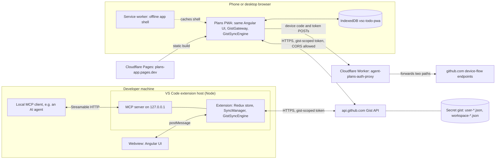
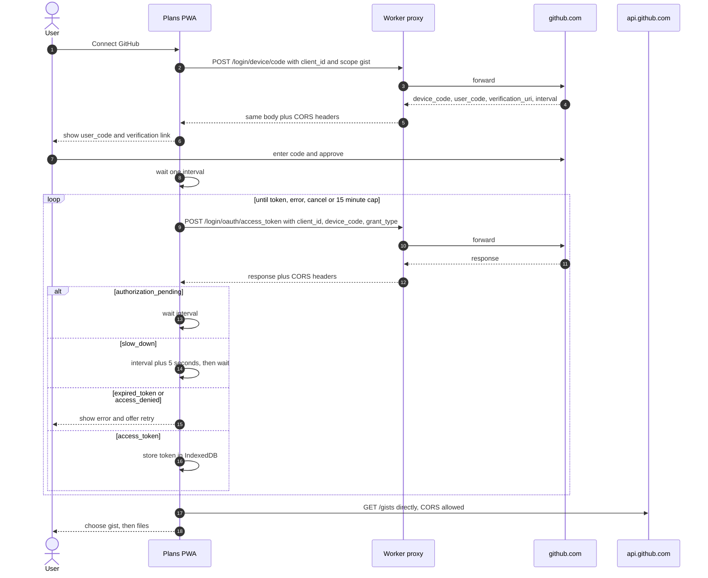
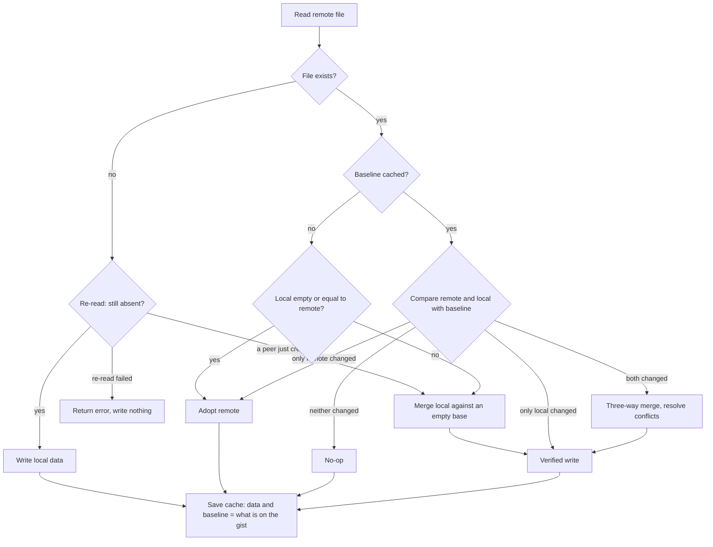
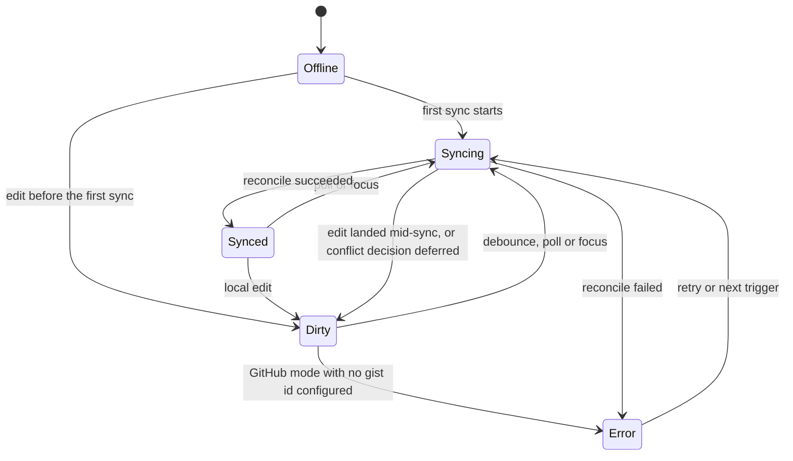

# Architecture

How VS Code Todo and its mobile companion, Plans, fit together, and why they are built this way.
Components link to their source. A reason not recorded in code, commits or by the maintainer is
marked *(inferred)*.

**Contents**

1. [TL;DR](#1-tldr)
2. [System context](#2-system-context)
3. [Names](#3-names)
4. [Repository layout](#4-repository-layout)
5. [Extension host](#5-extension-host)
6. [Webview and host messaging](#6-webview-and-host-messaging)
7. [One Angular app, two builds](#7-one-angular-app-two-builds)
8. [The PWA](#8-the-pwa)
9. [Authentication](#9-authentication)
10. [The Cloudflare Worker](#10-the-cloudflare-worker)
11. [Gist sync](#11-gist-sync)
12. [Three-way merge](#12-three-way-merge)
13. [The drift incident](#13-the-drift-incident)
14. [MCP server](#14-mcp-server)
15. [Testing and CI](#15-testing-and-ci)
16. [Deployment](#16-deployment)
17. [Key decisions](#17-key-decisions)
18. [Known limitations and what changes at scale](#18-known-limitations-and-what-changes-at-scale)

---

## 1. TL;DR

- **VS Code Todo** is a todo and notes extension for VS Code and editors that install from Open VSX. **Plans** is a PWA that opens the same lists on a phone.
- Three deployables: the extension (VS Code Marketplace, Open VSX), the PWA (Cloudflare Pages), and a CORS-only auth proxy (Cloudflare Workers).
- There is no application server. The two apps are peers that read and write one secret GitHub Gist.
- They agree because both run the same sync engine and three-way merge from [`packages/core`](packages/core/src/index.ts).

## 2. System context

Each surface talks only to what it needs. The PWA uses the Worker only to sign in; both apps call the gist API directly.


```mermaid
flowchart LR
  subgraph Desktop["Developer machine"]
    subgraph Host["VS Code extension host (Node)"]
      EXT["Extension: Redux store, SyncManager, GistSyncEngine"]
      MCP["MCP server on 127.0.0.1"]
    end
    WV["Webview: Angular UI"]
    AGENT["Local MCP client, e.g. an AI agent"]
  end
  subgraph Phone["Phone or desktop browser"]
    PWA["Plans PWA: same Angular UI, GistGateway, GistSyncEngine"]
    IDB[("IndexedDB vsc-todo-pwa")]
    SW["Service worker: offline app shell"]
  end
  PAGES["Cloudflare Pages: plans-app.pages.dev"]
  WORKER["Cloudflare Worker: agent-plans-auth-proxy"]
  GHOAUTH["github.com device-flow endpoints"]
  GHAPI["api.github.com Gist API"]
  GIST[("Secret gist: user-*.json, workspace-*.json")]

  WV <-->|"postMessage"| EXT
  AGENT <-->|"Streamable HTTP"| MCP
  MCP --- EXT
  PAGES -->|"static build"| PWA
  PWA <--> IDB
  SW -.->|"caches shell"| PWA
  PWA -->|"device code and token POSTs"| WORKER
  WORKER -->|"forwards two paths"| GHOAUTH
  EXT <-->|"HTTPS, gist-scoped token"| GHAPI
  PWA <-->|"HTTPS, gist-scoped token, CORS allowed"| GHAPI
  GHAPI --- GIST
```

The extension signs in through VS Code's built-in GitHub authentication, which the diagram omits.

## 3. Names

| Name | Refers to |
| --- | --- |
| VS Code Todo | Extension display name ([`package.json`](package.json)) |
| `vsc-todo` | Extension package name. Marketplace id `FrancescoAnzalone.vsc-todo`; command prefix `vsc-todo.*`; settings live under `vscodeTodo.*` |
| Plans / Agent Plans | PWA short name and tab title / full manifest name ([`manifest.webmanifest`](webview-ui/src/manifest.webmanifest)) |
| `plans-app` | Cloudflare Pages project, `plans-app.pages.dev` |
| `agent-plans-auth-proxy` | Cloudflare Worker ([`wrangler.toml`](worker/wrangler.toml)) |
| `@vsc-todo/core` | Shared package in `packages/core` |
| `vscode-todo` | GitHub repository `ai-autocoder/vscode-todo` |
| `VS Code Todo Sync` | Description stamped on gists either app creates |
| `vsc-todo-pwa` | The PWA's IndexedDB database |
| `vscode-todo-mcp` | Server name the MCP server reports |
| `hello-world`, `HelloWorldPanel` | Template leftovers: the webview's npm package and Angular project name; the editor-tab panel class |

## 4. Repository layout

The repo is organized by where code runs.

| Directory | Contents | Ships as |
| --- | --- | --- |
| [`src/`](src/extension.ts) | Extension host, TypeScript compiled to CommonJS | VSIX (`out/src/**`) |
| [`webview-ui/`](webview-ui/angular.json) | One Angular 21 app, two shipped builds (plus a dev configuration) | Inside the VSIX, and on Cloudflare Pages |
| [`packages/core/`](packages/core/src/index.ts) | Model, merge, sync engine, GitHub clients, IndexedDB stores; no runtime dependencies | Never published; compiled into both apps |
| [`worker/`](worker/src/index.ts) | Device-flow CORS proxy | Cloudflare Workers |

**How core reaches each app.** Both apps compile it from source:

- **Extension:** the root [`tsconfig.json`](tsconfig.json) compiles `packages/core/src/**` next to `src/**`. Extension code imports it through one file, [`src/core.ts`](src/core.ts) (`export * from "../packages/core/src/index"`). Two source roots make tsc emit `out/src/**`, hence `main` is `./out/src/extension.js`.
- **Webview and PWA:** [`webview-ui/tsconfig.json`](webview-ui/tsconfig.json) maps `@vsc-todo/core` to the source, and Angular's esbuild bundler follows the mapping.

**Why no `paths` alias in the extension.** Core is ESM with bundler-style resolution. `paths` only affects type checking, so tsc would emit `require("@vsc-todo/core")`, which Node cannot resolve. The extension would type-check and then fail on activation. A relative import compiles to a `require` of a file that exists in `out/`.

## 5. Extension host

On the desktop the extension host owns all data. The webview only renders it and sends commands.

**Activation.** [`extension.ts`](src/extension.ts) runs on `onStartupFinished`. It:

- creates the store and [`StorageSyncManager`](src/storage/StorageSyncManager.ts);
- wires up GitHub auth, [`SyncManager`](src/sync/SyncManager.ts) and the [MCP host](src/mcp/McpServerHost.ts);
- loads stored lists;
- registers the sidebar view ([`TodoViewProvider`](src/panels/TodoViewProvider.ts)) and the editor-tab panel ([`HelloWorldPanel`](src/panels/HelloWorldPanel.ts));
- replaces any Todo editor tab left by an earlier extension host (`HelloWorldPanel.replaceOrphanedTabs`). When the extension host restarts with the window open, as an update to the extension makes it do, VS Code keeps webview tabs open but never connects them to the new host, so the tab still takes input and drops everything it sends. The tabs are listed first thing in `activate()`, when every Todo tab open is the old host's. One in front in its group is replaced at once by a live panel in the same group; one behind another editor is replaced when it is next shown, so the update never brings it to the front. An unsent draft in the old tab is lost with it. The sidebar view does not need this: VS Code disposes it and resolves it again. The extension registers no panel serializer, so after a window reload the tab is gone rather than orphaned.

**Store.** [`store.ts`](src/todo/store.ts) holds five Redux Toolkit slices. `user` and `workspace` share one reducer object; `currentFile` reuses it, overrides `loadData` with its own payload shape, and adds `pinFile`.

| Slice | Holds |
| --- | --- |
| `user` | Todos for the VS Code profile |
| `workspace` | Todos for the open folder |
| `currentFile` | Todos for the active editor's file, plus `filePath`, `isPinned` |
| `editorFocusAndRecords` | Focused path, files that have todos, path aliases |
| `actionTracker` | Which slice the last action touched |

**Change pipeline.** A middleware records the slice each action touched. The single `store.subscribe` then updates both webviews and the status bar, persists the slice, and in GitHub mode schedules a push.

`loadData` and `pinFile` still schedule a push but do not mark the scope dirty. Tab switches and remote pulls dispatch `loadData`; treating them as edits would show "unsynced" on every file click.

**Scopes.**

- **User** lists belong to the profile.
- **Workspace** lists belong to the open folder.
- **Per-file** lists live in the workspace's `filesData` map, keyed by absolute path.

Machines disagree on absolute paths, so `filesDataPaths` stores absolute and workspace-relative aliases, and matching uses both ([`todoUtils.ts`](src/todo/todoUtils.ts)). [`editorHandler.ts`](src/editorHandler.ts) follows the active editor; file rename and delete events move or drop a file's list.

**Persistence and sync modes.**

| Scope | Mode | Data lives in |
| --- | --- | --- |
| User | Local (default) | `globalData.json` in extension storage, mirrored to `globalState.TodoData` |
| User | Profile Sync | `globalState.TodoData`, registered with `setKeysForSync(["TodoData", …])`, mirrored to `globalData.json` |
| User | GitHub Gist | Memento cache `gistCache_global_<file>`, reconciled with the gist |
| Workspace, per-file | Local | `workspaceState` plus `workspaceData.json` |
| Workspace, per-file | GitHub Gist | Memento cache `gistCache_workspace_<file>`, reconciled with the gist |

- **One key syncs in every mode.** `ratingPrompt.shown`, set once the rating prompt has been shown ([`RatingPrompt`](src/ratingPrompt/RatingPrompt.ts)), is registered with Settings Sync whatever the user mode, so a prompt answered on one machine is not asked again on another. `setKeysForSync` replaces the whole list, so `updateKeysForSync` adds it to the list of every mode, not only to Profile Sync's.
- **Multiple windows.** A file watcher on the JSON files keeps several VS Code windows in step (commit f2d64a7), except for the user list in Profile Sync (below).
- **Profile Sync loads `TodoData`, not the file.** Settings Sync carries only `TodoData`; `globalData.json` is this machine's own copy, so it is older whenever another machine changed the list while this one was closed. Activation used to load the file and write it over `TodoData`, and Settings Sync uploaded that, so the other machine's change was lost on both. Now activation loads `TodoData` and rewrites the file from it. VS Code replaces the memento's value when Settings Sync or another window changes it, and raises no event, so [`StorageSyncManager`](src/storage/StorageSyncManager.ts) looks every two seconds and on window focus, starting once `activate` has loaded the store and attached its subscriber. A look that finds a different object compares the content and reloads the store only if it differs; VS Code hands back a copy of every write, so the comparison, not the object, is what skips this window's own writes. A look that finds an edit still waiting to be stored leaves it to win, rather than showing the delivered list while the edit is stored. In this mode the file watcher does nothing: another window's file write can arrive before its memento change, so either copy may be the newer, and the next look loads that window's change. A look that finds another window has taken the mode out of Profile Sync, since the last look or since activation, takes the list from `TodoData` a last time, since the watcher ignored that window's last write; it reloads the store unless the mode is now GitHub, where the store shows the gist list. It does not write the file: the switching window already has, and a Local write made after the switch can reach this window before its `TodoData`. An edit waiting to be stored skips the step: its persist writes the list it shows everywhere. In Profile Sync the file is brought up to date at activation, on each persist and when this window leaves the mode (`userSyncModeChanged`); leaving another mode leaves it alone, since there it is already the newest copy. Every user mode change also registers the key with Settings Sync for Profile Sync only, where it used to be registered only at activation. `TodoData` holds the profile's own list in every mode: GitHub mode no longer writes the gist list into it, a mode change never writes it, and a storage directory that cannot be prepared leaves the list `TodoData` holds rather than an empty one ([`profileSync.test.ts`](src/test/sync/profileSync.test.ts)).
- **Mode is internal state, not a setting.** The mode is stored as `syncMode` and set only through commands that first connect GitHub and configure a gist ([`SyncCommands.ts`](src/sync/SyncCommands.ts)). A setting could switch a scope to GitHub mode with neither in place.
- **Gist cache is local truth.** In GitHub mode the gist cache is the local source of truth; per-file lists exist nowhere else.
- **Persists run one at a time per storage.** Each persist reads what is stored, changes it and writes it back, and persists overlap: the store subscriber does not wait for its own, and concurrent MCP calls each wait only for theirs. When two overlapped, both read the same state and the later write dropped the earlier one's change. [`StorageSyncManager`](src/storage/StorageSyncManager.ts) now queues them: one queue for the user scope, and one shared by the workspace and per-file lists, which write the same `workspaceData.json` and gist cache entry. The storage-file watchers join the same queues, so the extension's own writes reach them only after finishing, and the content comparison is what discards them. A per-file write still reaches the `TodoFilesData` memento when it is called, because tab switches and the MCP tools read that memento and write back what they read ([`knownDefects.test.ts`](src/test/sync/knownDefects.test.ts)).
- **A sync's result is folded into the store, not reloaded from the cache.** In GitHub mode a sync writes its result into the gist cache, and the store then has to show it. It used to reload the store from the cache, and an edit made in between was lost one way or the other: a persist carries the whole list the store shows, which until the reload is the list from before the sync. Stored before the write-back, the edit was overwritten and the reload took it off the screen. Stored after, it removed what the sync had pulled while the baseline said the gist had it, so the next sync pushed the pulled items away as deletions. Only the store holds every edit the moment it is made, so [`SyncManager`](src/sync/SyncManager.ts) now shows its result through `StorageSyncManager`, which implements the `SyncedStore` port. Each read of local state waits until no write to that storage is queued and reads the cache and the store in the same turn. At the end, the result is merged with what the store shows now, against what it showed at the last read, and loaded into the store in the same turn as that read, so no edit can come between. This uses the engine's `foldLocalEdits`, which settles a conflict by the policy rather than asking, since an edit made while a dialog was up would carry the list from before the fold; conflicts it settles are reported like the re-merge's. An edit the re-merge loop leaves unfolded when it stops at its bound of three dialogs is folded in the same way, since the base is what the store showed when the last merged local state was read. The write that stores the folded lists is queued in that same turn, behind the persist of every edit made before it, so the folded lists are stored last. For the workspace it covers the workspace slice, the per-file lists (through the per-file queue, so the memento has them at once) and the open file's slice. The base is what the store showed, not the cache, because windows share the user gist cache: another window's edit this store has not shown yet would otherwise read as a deletion made here. A sync whose scope left GitHub mode or moved to another file shows nothing ([`syncManagerConcurrency.test.ts`](src/test/sync/syncManagerConcurrency.test.ts)).
- **One writer for the per-file lists.** Every change to them goes through `StorageSyncManager.updateFiles`: a slice persist, and a file rename, delete or import. The change is a function of the stored lists, applied to the memento at the call and to the storage in its turn in the queue. Rename, delete and import used to write only the memento, and the next per-file persist rebuilds the lists from the storage, so it undid them: renaming the open file deleted its list, stranded it under the old path or duplicated it, and an import kept only the open file's part. Because the change runs twice, an import fixes its new ids and timestamps first (`withImportedIds` in core), or the memento and the storage would get different todos. A change that leaves the stored lists as they were writes nothing, so renaming a file that has no list does not mark the gist cache as owing a push. One that alters them fires `onDidUpdateFiles`, and in GitHub mode the extension marks the workspace dirty and schedules the push from there: no slice was edited, so the store subscriber would not ([`fileListChanges.test.ts`](src/test/sync/fileListChanges.test.ts)).

The status bar ([`statusBarItem.ts`](src/statusBarItem.ts)) shows counts for all three scopes. It adds a sync glyph only for error, syncing or dirty.

## 6. Webview and host messaging

The UI never touches storage or the network. It sends commands and renders the state the host sends back.

**Contract.** [`src/panels/message.ts`](src/panels/message.ts) defines 31 webview→host commands and 7 host→webview messages, including `reloadWebview` (full state and config) and `syncTodoData` (one slice). Payload types derive from the Redux action creators, and the webview imports the file directly, so changing a reducer's signature is a compile error in the UI.

**Flow.** The webview sends `webview-ready` and receives `reloadWebview`. After that, every edit goes UI → command → Redux action → subscriber → `syncTodoData`. The UI holds no authoritative state.

Posting raises nothing when no host receives the message, so the composer's add is the one command the UI waits on. `TodoService.addTodo` holds each add until a list from the host carries a new item with its text: a list for the same scope, and for a per-file add the same file, after the first one has arrived. If none does within 5 seconds, the add is handed back to the composer, which puts the text back with a "Not saved" notice. It goes back only into an empty box and only for the list the composer is adding to; otherwise it waits, and the notice says so. If the add arrives within the next minute after all, the text is taken out again, unless it has been edited. Both surfaces get this, since the PWA's gateway answers through the same messages.

**CSP.** Both extension surfaces, the sidebar view and the panel, serve `default-src 'none'; style-src <webview source> 'unsafe-inline'; script-src 'nonce-…'`. Local resources are limited to `out/` and the webview build ([`TodoViewProvider.ts`](src/panels/TodoViewProvider.ts)). The PWA has a policy of its own (§8).

The policy has no `connect-src`, so the webview cannot `fetch`. GitHub traffic comes from the Node host, where CORS does not apply, and the token stays in the host's SecretStorage.

**Who may send messages.** Host messages arrive as `message` events on `window`, and any window holding a reference to this one can post there. `TodoService` therefore applies a message only when [`vscode.isHostMessage`](webview-ui/src/app/utilities/vscode.ts) says the host sent it, and drops data that is not an object.

- Inside VS Code the host is the webview frame around the page. VS Code loads the page from the host page's own origin, so the host's messages carry that origin and the check is on it; the workbench and other webviews are on origins of their own. The sending window cannot be checked, because VS Code's injected script sets `window.parent` to the page's own window before the app's scripts run.
- In the PWA the host is the page itself, where the shell re-posts the gateway's messages (§7), so the check is that this window sent it. Without the check, any other window holding a reference to the page could post a `syncTodoData` of its own. It would replace the list on screen, and the next drag-to-reorder, which sends the whole list on screen back, would store it. On the deployed site `_headers` (§8) also takes those references away from other sites: they cannot frame the page, and COOP cuts the handle between it and any window it opens or that opens it. Under the dev server, which applies no `_headers`, the check is the only guard.

## 7. One Angular app, two builds

The PWA is not a second UI. It is the webview built with a different configuration, plus a bridge that replaces the extension host.

| | Extension build | PWA build (`pwa` configuration in [`angular.json`](webview-ui/angular.json)) |
| --- | --- | --- |
| Index | `index.html` → `<app-root>` | [`index.pwa.html`](webview-ui/src/index.pwa.html) → `<app-pwa-shell>` |
| Environment | `environment.prod.ts` (`pwa: false`), swapped by the `production` configuration | [`environment.pwa.ts`](webview-ui/src/environments/environment.pwa.ts): client id, proxy URL |
| Bootstrap | [`bootstrap.ts`](webview-ui/src/bootstrap.ts) → `AppModule` | [`bootstrap.pwa.ts`](webview-ui/src/bootstrap.pwa.ts) → `PwaAppModule` |
| Data provider | [`data.providers.ts`](webview-ui/src/app/data/data.providers.ts) → `VsCodeGateway` | [`data.providers.pwa.ts`](webview-ui/src/app/data/data.providers.pwa.ts) → `GistGateway` |
| Extra stylesheet | none | [`vscode-theme.css`](webview-ui/src/pwa/vscode-theme.css) |
| Service worker, manifest, app icons, Pages `_headers` | no | yes — the `pwa` configuration adds `manifest.webmanifest`, `icons` and `_headers` to `assets`. There is no `_redirects`: Pages' own SPA fallback serves the app shell for deep links (§8) |
| Content-Security-Policy | a meta tag in the page the extension writes for each surface (`TodoViewProvider`, `HelloWorldPanel`), with a new nonce each time it writes the page (§6) | a meta tag in `index.pwa.html`, plus `frame-ancestors` and COOP in `_headers` (§8) |
| Critical-CSS inlining | on, but moot: the host writes its own page and never loads the built `index.html` | off (`optimization.styles.inlineCritical` on the `pwa` configuration), because it loads the stylesheet with an inline `onload` that `script-src 'self'` blocks, leaving the bundled global stylesheet (every `styles` entry, `vscode-theme.css` included) unapplied |
| Output hashing | none, because the `build` script passes `--output-hashing=none`, so the host loads `main.js` and friends by name | all |
| Output directory | `webview-ui/build/browser` | `webview-ui/build-pwa/browser`, set by `outputPath` on the `pwa` configuration. Separate directories, because the builder clears its output path and each build would otherwise delete the other (§16) |

**How the unmodified UI talks to a gist.** The seam is the message protocol:

1. The UI's `TodoService` posts through [`vscode.ts`](webview-ui/src/app/utilities/vscode.ts). Outside VS Code there is no `acquireVsCodeApi`, so the wrapper calls an installed delegate.
2. [`PwaShellComponent`](webview-ui/src/app/pwa/pwa-shell.component.ts) installs that delegate, which routes each message through [`message-dispatcher.ts`](webview-ui/src/app/data/message-dispatcher.ts) to [`GistGateway`](webview-ui/src/app/data/gist-gateway.ts).
3. The gateway emits the host's message shapes, and the shell re-posts them with `window.postMessage`. `TodoService` handles them as if the extension had sent them, and only those: in the PWA it accepts a message only when this window posted it (§6).

[`DataGateway`](webview-ui/src/app/data/data-gateway.ts) types each command as `Parameters<typeof messagesFromWebview.X>`, holding both gateways to the extension's contract. Only the PWA injects it today. In the extension build, `VsCodeGateway` is registered but never constructed; moving `TodoService` onto it is recorded as deferred.

**Why a build-time swap.** A runtime `if` with a dynamic `import()` would make esbuild split the bundle. The webview CSP allows scripts by nonce only, and imported chunks don't inherit the nonce ([`bootstrap.ts`](webview-ui/src/bootstrap.ts)).

A side effect is that no gist, device-flow or IndexedDB code reaches the extension. A fresh extension build contains none of `login/device/code`, `agent-plans-auth-proxy`, `vsc-todo-pwa` or `api.github.com`.

**Shared by default.** Only `src/pwa/**`, `src/app/pwa/**`, `*.pwa.*` files and the gateway/dispatcher they alone reach are PWA-only. Any other edit changes both surfaces, and the extension half ships only with the next Marketplace release.

## 8. The PWA

Plans is a static site. All state lives on the device and in the gist, so hosting is a CDN.

**Installability.** Three pieces, all included only in the PWA build:

- **Manifest.** [`manifest.webmanifest`](webview-ui/src/manifest.webmanifest) declares a standalone portrait app with maskable icons.
- **Service worker.** Angular's service worker is registered only in the PWA production build ([`app.module.ts`](webview-ui/src/app/app.module.ts)). [`ngsw-config.json`](webview-ui/ngsw-config.json) prefetches the app shell and defines no data groups: API responses are never cached, and offline data comes from IndexedDB.
- **Headers.** [`_headers`](webview-ui/src/_headers) sends `Cache-Control: no-cache` on `ngsw-worker.js`, `ngsw.json`, `manifest.webmanifest` and the app shell at `/`, so the browser revalidates each before reusing it and no HTTP cache pins a client to an old build. The shell's rule is on `/`, not `/index.html`: a rule matches the request path, and Pages answers `/index.html` with a 308 to `/`, so a rule there would reach only the redirect. The service worker asks for `/index.html` too; it follows the redirect, then fetches `/` again and caches that copy without a hash check, so `/`'s header governs its copy as well. Every other file of the current deployment, its hashed bundles included, and the shell wherever it is served at a path other than `/` keep Pages' default, `public, max-age=0, must-revalidate`, which also forces revalidation.

**Deep links.** A path that matches no file, such as `/some/deep/link`, gets the app shell with a 200. No rule of ours does that: it is Pages' [single-page application default](https://developers.cloudflare.com/pages/configuration/serving-pages/#single-page-application-spa-rendering). Before falling back to the shell, Pages tries two things. If an earlier deployment had a file at that path and the same Cloudflare data center served it within about the past week, Pages may serve that file again from its cache, so a client still on the previous build can usually load its old hashed bundles. That cache is best effort: Cloudflare says its entries [can disappear at any time](https://developers.cloudflare.com/pages/configuration/serving-pages/#asset-retention). Otherwise Pages looks for a `404.html` in the requested path's directory and each directory above it, up to the root, and serves the first one it finds with a 404. A top-level `404.html` would therefore turn the fallback off for every path, and a nested one for the paths under its directory. There is no `_redirects` either. The usual `/* /index.html 200` does nothing on Pages, which ignores it as an infinite loop: Pages redirects `/index.html` to `/`, which `/*` matches again. `wrangler pages dev` warns about such a rule, but `wrangler pages deploy` uploads the file without parsing it, so it prints no warning.

**Content-Security-Policy.** This origin's IndexedDB holds the gist token, so the page runs no script but the bundle's own. The policy is a meta tag in [`index.pwa.html`](webview-ui/src/index.pwa.html):

- `script-src 'self'`, so no inline script, inline handler, `javascript:` URL or `eval`.
- `connect-src` names every origin the PWA fetches: `api.github.com`, `gist.githubusercontent.com` (the raw URL a truncated file is read from) and the device-flow proxy. A new origin must be added there, or its requests fail in the PWA. Karma and the extension webview never load that page, so no test would notice; CI checks that the proxy URL in `environment.pwa.ts` is listed.
- Images may come from any https host, because todo Markdown can link one.
- `style-src` allows inline styles, which Angular, Mermaid and KaTeX all write.
- `form-action 'none'`. The app has no forms, but a diagram's HTML label can still draw one, which would send whatever is typed into it anywhere.

It is a meta tag rather than a header for two reasons. It travels with the page, so the dev server, which ignores `_headers`, applies it too. And a site-wide header would also land on `ngsw-worker.js`, where a worker's own policy governs its fetches, including the images it fetches on the page's behalf. `_headers` adds on `/*` the two things a meta tag cannot carry: `frame-ancestors 'none'`, and `Cross-Origin-Opener-Policy: same-origin`, so that a window that opens the app, or that the app opens, keeps no handle to post messages through.

**IndexedDB** (database `vsc-todo-pwa`). Each store opens the database unversioned and bumps the version if its own store is missing, so stores are added independently ([`indexedDb.ts`](packages/core/src/indexedDb.ts), commit b3e1b89).

| Store | Contents |
| --- | --- |
| `sync-cache` | One sync cache per gist file (§11) ([`indexedDbStores.ts`](packages/core/src/indexedDbStores.ts)) |
| `auth` | Token, gist id, chosen file names |
| `conflicts` | Pending conflict reviews, at most 50, each tagged with the gist file it was made against; only the selected files' records are shown or applied ([`pending-conflicts.store.ts`](webview-ui/src/app/pwa/conflicts/pending-conflicts.store.ts)) |
| `preferences` | Wide View, Show Tags |

**Session restore.** `GistGateway.restoreSession()` reloads the lists from the sync cache before any reconcile can run. Previously the app started with an empty list against a populated baseline, read that as "the user deleted everything", and pushed it (commit 359034e). With a token, gist and file stored, the app reaches "connected" without a network call.

The user always chooses the gist, and both a user and a workspace file are required, because the PWA has no local-only mode. Edits run through `todoMutations` ([`todoReducers.ts`](packages/core/src/todoReducers.ts)), the framework-agnostic port of the extension's reducers.

**Touch layout.** [`vscode-theme.css`](webview-ui/src/pwa/vscode-theme.css) supplies the `--vscode-*` variables VS Code would inject. It puts every mobile rule (48 px targets, larger text, visible row actions) under `@media (pointer: coarse)`, keyed to the pointer rather than the width, so a phone in landscape still gets touch targets.

**Deploy.** `npm run deploy:pwa` clears `webview-ui/build-pwa` (the PWA's own output directory, separate from the extension webview's `webview-ui/build` — §16), builds, and uploads that build's `browser/` with `--branch main`.

## 9. Authentication

Both apps need a token with the `gist` scope. They get it differently: one runs inside VS Code, the other is a public web page.

| | Extension | PWA |
| --- | --- | --- |
| Mechanism | VS Code GitHub provider, `getSession("github", ["gist"])` ([`GitHubAuthManager.ts`](src/sync/GitHubAuthManager.ts)) | OAuth 2.0 Device Authorization Grant (RFC 8628) with a public GitHub client id ([`deviceFlow.ts`](packages/core/src/deviceFlow.ts)) |
| Secret | none handled | none; the client id is public |
| Token storage | VS Code SecretStorage | IndexedDB, plaintext |
| Invalid token | checked with `GET /gists` | next gist call returns 401/403; banner offers Reconnect |
| Disconnect | deletes the token; scopes return to local | deletes token, gist id, files, sync cache, conflicts |

**Why device flow.** Everything shipped to a browser is public, so the PWA cannot hold a client secret. Device flow needs only the public `client_id`. *(Inferred)* The authorization-code flow would also need a server to exchange the code and a redirect URI tied to one origin.

The costs: the user types a short code on github.com, and github.com's device endpoints send no CORS headers, hence the Worker (§10).


```mermaid
sequenceDiagram
  autonumber
  actor U as User
  participant P as Plans PWA
  participant W as Worker proxy
  participant G as github.com
  participant A as api.github.com
  U->>P: Connect GitHub
  P->>W: POST /login/device/code with client_id and scope gist
  W->>G: forward
  G-->>W: device_code, user_code, verification_uri, interval
  W-->>P: same body plus CORS headers
  P-->>U: show user_code and verification link
  U->>G: enter code and approve
  P->>P: wait one interval
  loop until token, error, cancel or 15 minute cap
    P->>W: POST /login/oauth/access_token with client_id, device_code, grant_type
    W->>G: forward
    G-->>W: response
    W-->>P: response plus CORS headers
    alt authorization_pending
      P->>P: wait interval
    else slow_down
      P->>P: interval plus 5 seconds, then wait
    else expired_token or access_denied
      P-->>U: show error and offer retry
    else access_token
      P->>P: store token in IndexedDB
    end
  end
  P->>A: GET /gists directly, CORS allowed
  P-->>U: choose gist, then files
```

**The storage trade-off.** In the PWA, any script running on the origin can read the token.

- **Why IndexedDB.** It is less directly exposed than `localStorage` and survives a phone's frequent cold starts ([`indexedDbStores.ts`](packages/core/src/indexedDbStores.ts)).
- **Mitigations.** The `gist`-only scope and an explicit Disconnect.
- **What remains.** The scope still covers every gist in the account, and Disconnect does not revoke the token on GitHub.

## 10. The Cloudflare Worker

The Worker exists because two GitHub endpoints lack CORS headers. It is a stateless pass-through with no secrets ([`worker/src/index.ts`](worker/src/index.ts)).

GitHub's device-flow endpoints on github.com send no CORS headers, so a browser cannot read their responses. `api.github.com` does allow CORS, so gist traffic never passes through the Worker. Device flow uses only a public `client_id`, so the Worker has nothing secret to hold.

| Control | Behaviour |
| --- | --- |
| Methods, checked first | `POST` is forwarded, `OPTIONS` answered with 204; any other method gets 405 |
| Paths | A `POST` is forwarded only to `/login/device/code` or `/login/oauth/access_token`; any other path gets 404 |
| Origins | `ALLOWED_ORIGINS = "https://plans-app.pages.dev"` (commit 24d6c9f). `Access-Control-Allow-Origin` echoes a listed origin, otherwise names the first listed one |
| Client id | Optional `CLIENT_ID`: a body with a different `client_id` gets 403. Commented out in [`wrangler.toml`](worker/wrangler.toml) |
| Upstream failure | 502 `upstream_unreachable`; GitHub's status codes pass through |

**Caveats.**

- **The origin allowlist is CORS, not access control.** Requests from any origin are still forwarded, and browsers simply cannot read the response. A client that sends no `Origin`, such as `curl`, gets `*`.
- **Preview deployments cannot sign in.** Pages gives each deployment its own `<hash>.plans-app.pages.dev` origin, which is not on the list, so sign-in works only on the production domain.

## 11. Gist sync

Each gist file is reconciled across three versions: the device's copy, the gist, and the last version the two agreed on. The engine is shared; each app supplies only I/O, storage and conflict handling.

**Gist layout.** One JSON file per list. The filename prefix replaces directories, since gist filenames cannot contain `/` ([`syncTypes.ts`](packages/core/src/syncTypes.ts)).

```text
user-todos.json         { "userTodos": Todo[] }
workspace-<name>.json   { "workspaceTodos": Todo[],
                          "filesData":      { "<absolute path>": Todo[] },
                          "filesDataPaths": { "<absolute path>": { "absPaths": [...], "relPaths": [...] } } }
```

A `Todo` is `{ id, text, completed, creationDate, completionDate?, isMarkdown, isNote, collapsed?, tags? }` ([`todoTypes.ts`](packages/core/src/todoTypes.ts)). A gist can hold several lists, e.g. `user-Work.json`.

**Engine and ports.** [`GistSyncEngine`](packages/core/src/gistSyncEngine.ts) reconciles one file per call and depends only on three interfaces.

| Port | Extension | PWA |
| --- | --- | --- |
| `GistFileIO` | [`GitHubApiClient`](src/sync/GitHubApiClient.ts) | [`GistClient`](packages/core/src/gistClient.ts) |
| `CacheStore` | [`MementoCacheStore`](src/sync/MementoCacheStore.ts), using the keys the extension already had, so upgrades keep their baselines | `IndexedDbCacheStore` |
| `ConflictResolver` | [`ConflictResolutionUI`](src/sync/ConflictResolutionUI.ts), blocking quick picks | `GistGateway.askAboutConflicts`, which parks the reconcile and renders [`ConflictPromptComponent`](webview-ui/src/app/pwa/conflicts/conflict-prompt.component.ts); anything left undecided falls to `prefer-local` and is recorded for review |

**The cache.** Per file: `data` (this device's copy), `lastCleanRemoteData` (the baseline: content known to be on the gist), `lastSynced`, and an informational `isDirty`. The engine detects changes by comparing content with the baseline, not by trusting the flag.


```mermaid
flowchart TD
  A["Read remote file"] --> B{"File exists?"}
  B -- "no" --> S{"Re-read: still absent?"}
  S -- "yes" --> W["Write local data"] --> J["Save cache: data and baseline = what is on the gist"]
  S -- "a peer just created it" --> M["Merge local against an empty base"] --> V
  S -- "re-read failed" --> X["Return error, write nothing"]
  B -- "yes" --> C{"Baseline cached?"}
  C -- "no" --> D{"Local empty or equal to remote?"}
  D -- "yes" --> P["Adopt remote"] --> J
  D -- "no" --> M
  C -- "yes" --> E{"Compare remote and local with baseline"}
  E -- "neither changed" --> N["No-op"] --> J
  E -- "only remote changed" --> P
  E -- "only local changed" --> V["Verified write"]
  E -- "both changed" --> T["Three-way merge, resolve conflicts"] --> V
  V --> J
```

- **A missing baseline is never evidence of a local edit.** Before commit 023c981, a device with an empty cache pushed its empty list over a populated gist.
- **The saved baseline is a deep copy.** VS Code mementos return their live object and the extension used to edit it in place, so a shared object would move the baseline along with the edit (commit 218411c).
- **The reconcile works on its own copy of local data, and the baseline is parsed from the bytes written.** The extension's per-file persist used to edit the snapshot a reconcile was pushing, through the live memento object. An edit made during the `PATCH` then reached the baseline but not the gist, and the next sync pulled it away. `SyncStorageManager` and `MementoCacheStore` now copy on every read and write, so no live memento object leaves them.

**Verified write.** The gist API has no conditional write, so read → merge → write can overwrite another device's push. Worse, the overwritten state becomes the baseline and the lost change is never pulled back.

`pushVerified` re-reads before every `PATCH`. If the file moved, it merges against the fresh content, using the earlier read as the common ancestor, and retries up to three times. After that it returns a retryable error and leaves the remote and baseline untouched.

Only a genuine "file not found" lets a write skip the comparison. A network error or rate limit aborts instead (commit 4afdfba).

**Cache writes are serialized.** `persistLocal` reads an entry and writes it back with the baseline it read. In the PWA those are two IndexedDB transactions, fired on every edit without waiting. A reconcile saving its new baseline between the two had it overwritten with the old one, and the next merge then read a todo it had pushed, and the user had since deleted, as an addition from the other device and restored it. The engine runs `persistLocal`, `persistUnsynced` and `saveCache` one at a time per engine. Nothing in that critical section waits on the network, so an edit's persist waits for at most a store write, never a round trip ([`gistSyncConcurrency.test.ts`](packages/core/test/gistSyncConcurrency.test.ts)).

**Reads must be uncached.** Both the change detection and the verified write are only as good as the freshness of the read behind them, and `api.github.com` answers a gist `GET` with `Cache-Control: private, max-age=60`. In a browser that means the HTTP cache answers the next minute of identical reads with no network request — so the PWA could read a gist the extension had already updated, see `remote == base`, classify a peer's edit as "only local changed", and take the straight push path: no merge, no conflict prompt, and the overwrite recorded as the clean baseline. `pushVerified`'s re-read hit the same cache entry and agreed nothing had moved. Only the PWA was affected, and the reason is the `GistFileIO` row of the table above: the engine and the merge are shared, but each host brings its own HTTP client. The extension's is `GitHubApiClient`, which is `vscode`-bound and runs in the extension host — Node, no HTTP cache — so it read fresh throughout and raised the conflict correctly while the PWA silently won. It needs no directive of its own and can never be hosted in a browser. `GistClient` now sends `cache: "no-cache"` on every read (`no-cache`, not `no-store`: it still revalidates with the ETag, and GitHub's 304s are free against the rate limit). Guarded by [`gistClient.test.ts`](packages/core/test/gistClient.test.ts).

**Scheduling.** The engine decides what to write; each app decides when.

| | Extension ([`SyncManager.ts`](src/sync/SyncManager.ts)) | PWA ([`gist-gateway.ts`](webview-ui/src/app/data/gist-gateway.ts)) |
| --- | --- | --- |
| Push | 3 s after the last edit | 3 s after the last edit |
| Pull | Poll every `pollInterval` s (default 180, clamped 30–600), by default only while a Todo view is visible ([`WebviewVisibilityCoordinator`](src/sync/WebviewVisibilityCoordinator.ts)) | Poll on the same interval and bounds while the page is visible; stops while hidden, and a return pulls if one came due meanwhile — or straight away if a scope owes a push. Also on connect |
| Overlap | Per-scope in-progress flag; a trigger mid-sync queues one re-run | One promise queue for every reconcile |
| Edit during a sync | Recovered from the cache, then merged into the result with the snapshot as base (`reconcileWithLocalEdits`), which asks the resolver about its own conflicts. The snapshot is a copy read in one go, so an edit lands in storage and never in it. An edit made after the last read, up to the moment the result reaches the screen, is folded in from the store instead (§5) | Detected by a generation counter, then the same merge, asking the same way. The snapshot is a copy: the slice is edited in place, so a shared one took on the edit and the merge dropped it. The adopted result, including the open file's projection, reaches the screen before the re-persist is awaited: an edit or a drag-and-drop landing in that IndexedDB write works on the new list, not a stale one it would write back. An import applies all its halves before its first await for the same reason |
| Durability | Every edit is written to the memento cache | Every edit is written to IndexedDB immediately, baseline untouched — once the file has a cache entry. Before its first successful sync there is none to write into, so the edit lives in memory until a sync or a list switch writes one |
| List switch | Nothing to carry over: every reconcile reads its snapshot from the chosen file's cache | On the sync queue: pushes what the old file is owed — or saves it, or refuses the switch — then **replaces** the slice with the new file's cache, or an empty list |
| Gist switch | No reset: cache entries are keyed by scope and file name only, not by gist | On the sync queue: reconciles each scope with the old gist, then clears the cache and the slices. Lists the old gist can never take are carried to the files picked next; an edit it still could take refuses the switch |
| Failure | Scope shows Error; polling continues | Retries at 3 s × 2ⁿ, up to 3 times; banner says auth, damaged file, missing gist or other |

**The PWA's list belongs to one file.** The extension hands the engine a snapshot read per file, so it cannot reconcile one file with another's todos. The PWA keeps one in-memory slice per scope and hands *that* over, so a list switch must replace the slice rather than just rename the file behind it. Keeping the old slice pushed the old list into the one just picked: with no baseline the engine merged every old todo in as an addition, and with one it read them as local edits and wrote them over the file. The switch also runs on the sync queue, so a reconcile of the old file cannot land its result in the new file's slice. `currentFile` and the per-file lists go with the slice. An edit the old file is still owed is pushed first. If that fails it is saved to the old file's cache, without a baseline if the file never synced, so its next sync bootstraps from it. If even that write fails, the switch is refused and the persist-failure banner says why. The review screen's records stay, but only the selected files' records are shown: todo ids and per-file paths are unique only within one file, so applying another list's record would write its todo into this one ([`gist-gateway-file-switch.spec.ts`](webview-ui/src/app/data/gist-gateway-file-switch.spec.ts)).

**A gist switch settles the gist it leaves.** It clears the whole sync cache, since the entries are keyed by file name and would otherwise serve one gist's baseline to another, so an unpushed edit has nowhere to wait the way it does on a list switch. Each selected scope is reconciled against the old gist first: a push if it owes one, otherwise a pull, which is how a gist deleted since the last pull is noticed. If that run fails, its failure decides. A failure retrying cannot fix (the gist was deleted, its file cannot be read, the token or the gist rejects the write) means this device holds the only copy, so the scope's lists are carried over. The files picked in the new gist get them as an unsynced entry with no baseline, and their first sync bootstraps, merging the lists with what the files hold against an empty base. A file that already has an entry keeps it and gains only the carried todos whose ids it lacks: written over the entry, the carried lists would read every other todo as deleted on this device. This is the recovery the "gist not found" banner offers. Anything else, a dropped connection or a declined conflict, refuses the switch if a push was owed, because the edit can still reach the gist it was made in; with nothing owed the old gist holds everything, and the switch goes ahead. `createSyncGist` settles before it creates, so a refused switch leaves no empty gist behind. The carried lists survive a reload: one record, naming the gist and the files they came from, is written before anything is cleared, then the file selections go, then the cache (keeping the record), then the record stops naming the files and the new gist id is saved. A reload that finds the old gist with no files selected finishes the reset and returns to the gist picker, not to the old gist's file picker, whose listing fails for a deleted gist. Otherwise each scope whose file is selected is dropped from the record, since that file holds the lists: a file they went into got them before the selection was saved, and the file they came from never had them taken out. Any other file was picked since, and adding them again there would bring back todos deleted since, or put them in a file they were never meant for, whenever the record outlived a failed removal. Only the file they came from, still named in the record, with no cache entry (it never synced) gets them written back, the record being its only copy. A scope with no file selected keeps waiting.

**Status.** Each scope reports one of five states. The status bar shows the most urgent scope; the header shows the current tab's.


```mermaid
stateDiagram-v2
  [*] --> Offline
  Offline --> Syncing: first sync starts
  Offline --> Dirty: edit before the first sync
  Synced --> Dirty: local edit
  Dirty --> Syncing: debounce, poll or focus
  Dirty --> Error: GitHub mode with no gist id configured
  Synced --> Syncing: poll or focus
  Syncing --> Synced: reconcile succeeded
  Syncing --> Dirty: edit landed mid-sync, or conflict decision deferred
  Syncing --> Error: reconcile failed
  Error --> Syncing: retry or next trigger
```

Two rules sit on top of the diagram. An edit during `Error` leaves `Error` showing, because the failure is the more important news. Any state returns to `Offline` when the scope leaves GitHub mode, which is the one status `resetStatus` may always set.

**Errors and truncation.** Both HTTP clients map 401/403 → auth, 404 → not found, 422 → validation, 429 → rate limit. GitHub also uses 403 for secondary rate limits: the PWA tells them apart by the response text, the extension reports them as auth errors.

`GET /gists/:id` truncates large file contents. Both clients use inline content only when it is not marked `truncated`, and otherwise fetch `raw_url`.

## 12. Three-way merge

The merge compares each todo, by id, with its baseline version. Only a todo changed differently on both sides is a conflict ([`threeWayMerge.ts`](packages/core/src/threeWayMerge.ts)).

**The base** is `lastCleanRemoteData`, with three exceptions:

- bootstrap and seeding use an empty base, so everything counts as an addition;
- a verified-write retry uses the remote read immediately before the write it is retrying;
- folding in an edit made during a sync uses the snapshot the reconcile started from.

**Per-item decisions** ("changed" means `!isEqual` with the base version):

| In base | Local | Remote | Result |
| --- | --- | --- | --- |
| yes | unchanged | unchanged | keep |
| yes | changed | unchanged | take local |
| yes | unchanged | changed | take remote |
| yes | changed | changed identically | take it |
| yes | changed | changed differently | **`edit-edit` conflict** |
| yes | deleted | unchanged, or deleted | delete |
| yes | unchanged | deleted | delete |
| yes | changed | deleted | **`edit-delete` conflict** |
| yes | deleted | changed | **`delete-edit` conflict** |
| no | added | absent | add |
| no | absent | added | add |
| no | added | added, same content | add once |
| no | added | added, different content | **`id-collision`** |

**Settling conflicts.** Conflicting ids are left out of the auto-merged list and added back from a decision:

- A resolver decides where it can; anything it leaves out falls back to the policy.
- A `null` decision means the deletion stands.
- A `null` resolver result aborts the reconcile, so the question returns next sync.

Both apps ask before writing. The PWA's dialog additionally allows a partial answer: a conflict the user does not touch takes the `prefer-local` policy and is filed for the review screen, so the sync settles either way and nothing is decided in silence. Its bulk buttons refuse the three shapes where one tap destroys something unseen — a top-level `id-collision`, a per-file list one device removed, and a file whose *item* merge holds a collision (which `file-added-both` always does, since its item merge runs against an empty base) — and leave those cards open. The third has no keep-both to fall back on: a file decision is a whole `Todo[]`, so only leaving the card undecided preserves both sides, as the two recorded resolutions.

Declining and cancelling differ, and the difference is deliberate. **Cancel** is the user's answer for the whole pull: the focus-driven reconcile stops there rather than putting the other scope's dialog up in its place. A **hidden page** declines only the question it could not put — nobody could answer, and the promise the engine is awaiting holds the gateway's sync queue — so the other scope still reconciles, since its file may have nothing in dispute. Neither raises the failure banner or arms a retry; the focus handler asks again on return. A dialog open while the gist is switched is released before the switch reconciles the old gist, and every reconcile declines rather than asks until the switch is done (the round trip that creates a gist included), because the gist picker covers the dialog. The session is then dropped before the reset waits on the queue, or the next queued reconcile re-parks it behind the picker. A **list** switch keeps the session, so instead every reconcile declines rather than asks until the switch is done, because the file picker covers the dialog too. A dialog already open is released, and the picker's buttons are disabled until the switch lands. The push of the edit the old list is still owed declines too. A push that conflicts writes nothing, the edit is kept in that file's cache, and the question is asked when that list is next picked.

The re-merge against a mid-flight edit asks as well, through `decideAfterWrite`. It used to settle by policy with nobody asked, on the grounds that the reconcile had already pushed — but both versions in that merge are the user's, so keeping local silently is the same overwrite the resolver exists to prevent. What cannot work there is *cancelling*: the write has gone out and the baseline has moved, so there is nothing to call off. Declining degrades to "not now" — the policy settles it and the caller files it for review — which is also the path a hidden page takes.

Decisions must be sparse rather than a finished list. When the extension returned a list, "Skip This Conflict" deleted the item on both devices (commit 218411c).

**Id collisions.** Ids are random integers from `Math.random` ([`pure.ts`](packages/core/src/pure.ts)). An `id-collision` means either two new items drew the same id, or one item was compared without a baseline, and the data cannot tell which. Both apps offer **Keep Both** without recommending it. A collision the PWA user leaves undecided is kept both ways anyway rather than settled by the policy: picking a side would destroy a real item if the two were independently created.

**Workspace files.** `workspaceTodos` merges as above. `filesData` merges one path at a time:

- a file changed on one side takes that side;
- a file changed on both sides merges per item, escalating only real item conflicts (`file-edit-edit`);
- a file added on both sides merges against an empty base (`file-added-both` only for an id collision);
- edit against delete is `file-edit-delete` or `file-delete-edit`, settled by taking the preferred side whole.

`resolveFileConflict` settles only the conflicting ids, so both sides' additions to a file survive (commit f34ef26). `filesDataPaths` merges as a union, never dropping an alias either side still has.

**Order.** `threeWayMerge` returns an `order` — the merged list as todo ids — alongside the items. Local order is the skeleton: it is what the user of this device last saw and arranged, so a todo created at the top stays at the top and a drag-and-drop reorder survives. Items only the remote holds are spliced in beside the neighbours they have there (`findInsertionIndex`). A conflicted id holds its slot even before anything settles it, so a resolution lands where the item sits rather than at the end. Both resolvers return keep-both copies keyed by the conflict they came from, and each is placed directly after it; a collision the PWA user left undecided is settled afterwards by [`gist-gateway.ts`](webview-ui/src/app/data/gist-gateway.ts), which appends its copy to the end of the list. `assembleMerged` builds the final list from that skeleton, and every engine path goes through it.

Nothing detects "both devices reordered the same items", and nothing should: with no per-item position in the data model the two orders can only be picked between, so the one in front of the user wins. The other device pulls it down on its next sync and the two converge.

This replaced `mergeWithPreservedPositions`, which rebuilt the list in *base* order and appended everything else — the one order guaranteed to be stale, since both sides have by definition changed since. Until then every merging sync sent additions to the bottom and undid reorders.

**Canonical equality.** `isEqual` compares JSON with object keys sorted and array order kept, and `serialize` writes the same sorted form. A todo parsed from the gist and one built in code have different key orders. Key-order-sensitive comparison flagged untouched items as modified, pushed identical content every reconcile, and raised phantom conflicts (commits f8fe3c9, 218411c).

**Why content, not timestamps or revisions.**

- **Timestamps.** The model has no `updatedAt` and device clocks differ. Commit 09273c0 replaced timestamp-based detection with content comparison against a tracked clean remote to stop false conflicts.
- **Revisions.** A gist revision covers the whole file and cannot be made a precondition for a write, so it could detect a concurrent change but not prevent it, or say which items changed. *(inferred)*

The costs: every device needs a baseline, edits to different fields of one todo still conflict, and two reorders of the same items are picked between rather than merged.

**Worked example.** The gist and both devices start from the same baseline.

| Id | Baseline | Laptop (unsynced) | Phone (already pushed) | Merge on the laptop |
| --- | --- | --- | --- | --- |
| A | "Buy milk", open | unchanged | completed | take remote: completed |
| B | "Draft report" | "Draft report (final)" | "Draft report v2" | `edit-edit`: extension asks; if skipped, keeps "final" |
| C | "Book flights" | deleted | unchanged | delete |
| D | absent | "Call Sam", added at top | absent | add |

The laptop writes `[A completed, B final, D]` and records it as the baseline, with D last because of the ordering bug. The phone's next focus sees only the remote changed, and pulls. Running the engine on this input produces exactly this list and one conflict.

## 13. The drift incident

Until commit 218411c (8 Sep 2026) the extension kept its own copy of the sync logic, while the PWA ran `packages/core`. Two peers writing one file cannot afford to disagree, and these did:

- **Equality.** The extension's `isEqual` was plain `JSON.stringify`, so todos the PWA rewrote with sorted keys read as modified. The conflict dialog then showed the unchanged local value as the "remote" side.
- **`filesData` key order.** The extension wrote the map sorted but its merge rebuilt it unsorted, so identical content was pushed again and again.
- **Blind writes.** The extension's upload was a blind `PATCH` saved as the baseline, so a concurrent push from the phone was lost permanently.
- **A cache held across awaits.** One cache object was held across two network round trips and written back, dropping edits made in between.

Core already had the fixes for the first three; the extension did not. Earlier fixes had been hand-copied "byte-identical in both copies" (commit f34ef26), which is how the drift happened.

The fix was consolidation, not patching both copies. The extension moved onto the core engine through [`src/core.ts`](src/core.ts), `src/sync/ThreeWayMerge.ts` was deleted, and the extension's sync and todo types became re-exports.

Still duplicated outside core:

- [`GitHubApiClient`](src/sync/GitHubApiClient.ts) and [`GistClient`](packages/core/src/gistClient.ts)
- the reducers in [`store.ts`](src/todo/store.ts) and [`todoReducers.ts`](packages/core/src/todoReducers.ts)
- [`exporter.ts`](src/todo/exporter.ts) versus the export half of [`importExport.ts`](packages/core/src/importExport.ts)
- [`tagUtils.ts`](src/todo/tagUtils.ts), byte-identical in both places

The importer has moved: [`importer.ts`](src/todo/importer.ts) runs core's parsing and merge and keeps only the VS Code pickers and state writes. The merge normalizes only the imported items and overlays each onto the stored todo with its id, applying just the fields the file carries. A todo the file does not name comes back unchanged, so an import cannot turn it into an `edit-edit` conflict on the next sync. It used to re-normalize the whole merged list, which gave untouched todos fields like `collapsed: false` that then read as local edits.

## 14. MCP server

The extension can expose the lists to local AI agents over the Model Context Protocol. The calls run inside the extension host, so they read and write the live store ([`McpServerHost.ts`](src/mcp/McpServerHost.ts)); the listener itself runs in a worker thread.

**Transport.** A Node `http` server bound to `127.0.0.1` (default port 7337) serves `/mcp` with the SDK's Streamable HTTP transport. Replies are plain JSON rather than an SSE stream, because the server sends no notifications of its own (commit 92a892a). Each session gets its own server instance, keyed by UUID.

**Threading.** The extension host is one JS thread shared by every installed extension. When another extension blocks it, a listener on that thread cannot answer even `initialize`, so the client's connect times out, and Claude Code then drops the server for the whole session. That happened in practice: an auto-import extension rescanned 1.5 GB of `.vscode-test/` builds on every JS/TS file change, and each new git worktree set off hundreds of rescans just as an agent connected. So the listener, the request gates, the sessions and the SDK servers run in a `worker_threads` worker ([`mcpWorker.ts`](src/mcp/mcpWorker.ts) → [`McpHttpServer.ts`](src/mcp/McpHttpServer.ts)), which answers `initialize`, `tools/list` and argument validation on its own, and `resources/list` apart from its file entries. Tool calls and resource reads need the store and VS Code APIs, so the worker forwards them to the extension host over a message bridge ([`mcpBridge.ts`](src/mcp/mcpBridge.ts)), and `McpServerHost` answers them. Each forwarded call has a timeout: 60 s for a call or read, after which the tool reports that the host is busy (a change may still land later, and the message says so), and 5 s for the file-resource list inside `resources/list`, which then comes back without file entries rather than failing. Tool schemas and descriptions live in [`mcpDefinitions.ts`](src/mcp/mcpDefinitions.ts), which both threads load; the host re-parses forwarded arguments against the same shapes.

**Lifecycle.** Starts, stops and config changes run one at a time through a single queue, and each compares the config asked for with the one the running worker was started with, so a port or token change that arrives while a worker is still starting is applied rather than lost. A request error answers that request with 400 or 500, and the worker logs an unhandled rejection instead of exiting (Node ends a thread on one; VS Code's safety net covers only the main thread). If the worker still dies, the host restarts it with an exponential backoff (1, 2, 4, 8, then 16 s), and gives up with an error message at the sixth crash in a row; a worker that ran for a minute resets the count. A pending restart reads the config only when its turn in the queue comes, and any start or stop cancels it — even once its timer has fired and it is queued behind that stop — so a restart never brings back a server the user has just stopped or disabled. A stop first fails the calls still waiting on the extension host with a "server is stopping" error, and gives those replies one turn of the event loop before it closes the connections.

**Surface.** Eleven `todo_*` tools (list, count, add, add in bulk, list files, update text, set completed, note, markdown, tags, delete) and `todo://` resources. Writes go through [`TodoService`](src/todo/TodoService.ts), which dispatches the same Redux actions as the UI, so an agent's edit is persisted and synced like any other.

**Controls**: workspace trust before the server starts, then per request, in order: Origin → path → token → session.

| Control | Default | Behaviour |
| --- | --- | --- |
| `vscodeTodo.mcp.enabled` | `false` | Server not started |
| Workspace trust | required | Untrusted workspace: not started. Trust cannot be withdrawn without reloading the window, which stops the server, so requests are not re-checked |
| `readOnly` | `true` | Write tools refuse |
| `allowedScopes` | all three | Other scopes refuse |
| `token` | empty, meaning no auth | If set, requires `Bearer`, compared with `crypto.timingSafeEqual` |
| `Origin` | — | Absent is allowed (CLI clients); a present origin must be loopback, which blocks DNS rebinding. Its port is checked only when a fixed port is configured and the origin carries one |
| Sessions | 50 | Least recently used is evicted |

**Why HTTP rather than stdio** *(inferred)*. A stdio server is a process the MCP client launches. This server's data lives inside an already-running extension host, so a stdio server would need a second process plus IPC back into VS Code. HTTP lets the extension own the lifecycle and lets several agents connect.

The cost is a port any local process can reach, hence loopback binding, the Origin check, the token and read-only by default. The server also exists only while VS Code runs.

**Why VS Code only.** A web page cannot listen on a socket; the PWA's MCP commands are no-ops.

## 15. Testing and CI

Four suites on four runners guard four layers. CI runs them all, plus both Angular builds, on every pull request ([`ci.yml`](.github/workflows/ci.yml)).

| Suite | Runner | Cases | Protects |
| --- | --- | --- | --- |
| [`packages/core/test`](packages/core/test/gistSyncEngine.test.ts) | Vitest | 405 | Merge rules; every engine path (seed, bootstrap, verified write, edits during a sync, resolver); IndexedDB stores; reducers; import/export; the gist client and device flow |
| `webview-ui/src/**/*.spec.ts` | Karma + Jasmine, headless Chrome | 398 | Shared components, `GistGateway` (including list switching and mid-sync edits over the real engine), the conflict prompt and review, PWA shell, which window may send the app messages, what a diagram's `click` lines can do, the composer getting back an add the host never confirmed, the reorder animation measuring every row before it moves any |
| [`src/test`](src/test/sync/syncManagerConcurrency.test.ts) | Mocha in real VS Code (`@vscode/test`) | 297 | `SyncManager` concurrency and status, edits made while a sync's result reaches the store, overlapping storage writes, file rename, delete and import, the Profile Sync list at startup and mid-session, cache-key compatibility, cross-peer equality, truncation, MCP request gates, the MCP handshake while the extension host thread is blocked, MCP worker restarts and overlapping config changes, polling visibility, replacing a Todo tab left by an earlier extension host, when the rating prompt may show and what counts as activity for it |
| [`worker/test`](worker/test/index.test.ts) | Node's built-in `node:test` (Node 22.18+) | 18 | The CORS proxy's method, path, origin and client-id gates, and what it forwards |

Counts are declared test cases (`it(`/`test(` call sites, including `it.fails`, the known-bug helpers and skipped cases) as of 8 Oct 2026. Some call sites run more than once: the webview's model-based walk declares one case per seed, 24 in all, so Karma reports 421; four `it.each` tables in core expand to 419 Vitest cases; one extension case runs in two sync modes, and two call sites loop over two moments of a sync's write-back, one per scope, so Mocha reports 300. The `knownDefects` suites (and the `it.fails`/`KNOWN BUG` cases elsewhere) reproduce known defects, which are tracked in the workspace todo list. Each open defect's case passes while the defect is present and fails once it is fixed, which is the cue to turn it into a plain regression test; the suites keep those regression tests alongside the open cases. The worker's 18 call sites run 26 cases (two loop over methods and paths), three of them `todo`s for known gaps in its client-id allowlist.

**Regression tests follow the bugs.**

- [`gistSyncConcurrency.test.ts`](packages/core/test/gistSyncConcurrency.test.ts) pairs "loses the edit without the guard" with "keeps it with the guard".
- [`gistSyncRegression.test.ts`](packages/core/test/gistSyncRegression.test.ts) names the data-loss scenarios.
- [`crossPeerEquality.test.ts`](src/test/sync/crossPeerEquality.test.ts) checks that both peers write identical bytes, and agree on order.
- [`gistSyncOrdering.test.ts`](packages/core/test/gistSyncOrdering.test.ts) pins the ordering rule (§12) on every merging path, including convergence between two peers.
- [`gistSyncMalformed.test.ts`](packages/core/test/gistSyncMalformed.test.ts) pins that a damaged gist file stops the sync instead of being read as a deletion, at each of the three read sites.
- [`gist-gateway-file-switch.spec.ts`](webview-ui/src/app/data/gist-gateway-file-switch.spec.ts) drives the gateway through its public entry points (`chooseFiles`, `addTodo`, …) over the real engine and a gist of several files. Its cache store copies the way IndexedDB does. Every other gateway suite pinned the file names, called the reconciles directly and assigned arrays into the slices. That is why a switch that pushed one list into another shipped, and why an edit made while a sync was on the network could be dropped: the mutations edit the slice in place, and the reconcile's snapshot shared it.
  - Its seeded random walk mixes edits, deletes, per-file lists, other-device pushes, dropped connections, overlapping syncs and switches.
  - Every call resolves on a macrotask, as `fetch` and IndexedDB do, and every user step runs between macrotasks. So any interleaving it finds can happen in the app.
  - Writes take effect when sent and reads see the file when answered, so the engine's verify-then-write stays atomic. The window that remains in reality is the missing compare-and-swap above, which no client can close.
  - After every step it checks that no file holds a todo never added to it, and whenever it settles, that each file matches a model.
  - Nobody went looking for the three losses it found, and each now has a targeted test: the shared snapshot, the baseline a persist put back (above), and a per-file edit landing while a pull re-persisted, which wrote the open file's stale list back over what the pull had brought in.
  - Review turned up three more of the same family, outside what the walk does, and they are pinned beside it. A drag-and-drop in the same window; an import's second half applied after its first save; and review records that shared todo objects with the list. The last meant an edit after the sync changed the record too, so "edited since" never fired and keep-all overwrote the later edit.

**CI** runs four parallel jobs:

- **core:** typecheck and Vitest.
- **webview:** Karma, the extension webview build, then the PWA build. The PWA output is then asserted (`app-pwa-shell` in `index.html`, plus manifest, service worker and Pages headers), because a build with the wrong configuration still exits 0. So is its CSP (§8): `script-src 'self'`, a `connect-src` that lists the proxy URL from `environment.pwa.ts`, no inline script or event handler in `index.html`, and `frame-ancestors` in `_headers`.
- **worker:** the proxy's `node:test` suite, on Node 24 (it needs built-in TypeScript stripping, so it does not use the pinned Node 20).
- **extension:** lint, compile, Mocha under `xvfb`.

Both Angular targets are built because nothing else type-checks the PWA-only files. The extension test glob was also widened after the sync suites turned out never to have run (commit a608fd5).

## 16. Deployment

Three independent targets. Nothing deploys automatically: the only workflow is CI, and the Pages project has no Git integration.

| Change | Target | Command |
| --- | --- | --- |
| `src/**`, `packages/core/**`, shared `webview-ui` files | VS Code Marketplace and Open VSX | `vsce publish` (maintainer) |
| `webview-ui/**`, `packages/core/**` | Cloudflare Pages `plans-app` | `npm run deploy:pwa` |
| `worker/**` | Cloudflare Workers | `npm run deploy:worker` |

- **Core ships twice.** A `packages/core` change needs both a Pages deploy and a Marketplace release.
- **Separate output directories.** The extension build emits to `webview-ui/build/browser`, the PWA build to `webview-ui/build-pwa/browser`. They shared one directory until it became clear that the Angular builder clears its output path, so whichever target built last replaced the other — a PWA build left `webview-ui/build` holding hashed PWA output that `vsce package` would ship as the extension webview.
- **The VSIX** carries `out/` and `webview-ui/build`; [`.vscodeignore`](.vscodeignore) excludes sources, `packages/**`, `worker/**`, `webview-ui/build-pwa/**`, tests and docs. `vscode:prepublish` runs `npm prune --include=dev`, then `compile` **and** `build:webview`, so a package never ships whatever webview build — or stray extraneous dependency — happened to be on disk. The prune is what keeps a `npm i --no-save` out of the vsix; `--include=dev` stops it honouring `NODE_ENV=production` and deleting the toolchain the build needs.
- **PWA preflight.** [`preflight-deploy-pwa.js`](scripts/preflight-deploy-pwa.js) clears `webview-ui/build-pwa` and logs the revision being deployed. It was added in bd3a6b6 to clear the then-shared directory; that commit's stated premise — that the extension's unhashed `main.js` lingers through a PWA build — is wrong, since the builder clears its output path outright.
- **`--branch main`.** Pages serves the apex domain only from its production branch, so verify releases on `plans-app.pages.dev`, not the per-deployment URL.

## 17. Key decisions

| Decision | Alternatives | Why | Cost accepted |
| --- | --- | --- | --- |
| GitHub Gist as the only backend | Own API and database; hosted backend-as-a-service | Both apps are free and a gist costs nothing to host. *(inferred)* Data stays in the user's account | No server-side concurrency control; polling; GitHub rate and size limits; plaintext JSON |
| Device flow for PWA sign-in | Redirect-based code flow; pasted access token | A public client cannot hold a secret; device flow needs only the client id | User types a code; needs a CORS proxy |
| Worker as a CORS shim only | Auth backend with sessions; third-party proxy | Nothing to protect: no secrets, no state, gist traffic goes direct | Extra deployable; CORS-only origin check; previews cannot sign in |
| Shared core compiled into both apps | Duplicated logic; published npm package | Peers writing one file must agree; separate copies drifted into phantom conflicts and lost writes (218411c) | Relative-import seam; core changes need an extension release |
| Content-based three-way merge | Last-write-wins; timestamps; CRDTs | Replaced timestamp detection that raised false conflicts (09273c0). *(inferred)* Keeps plain JSON compatible with existing gists | Per-device baseline; same-item field edits conflict; two reorders are picked between |
| Both apps ask, and the PWA also allows a partial answer | PWA-only `prefer-local` with review afterwards | Whichever peer synced *second* silently replaced the other's version and said so only in a banner; a policy is the wrong default when someone is there to ask | Sync waits on the user; a hidden page cannot be asked, so it defers instead |
| PWA: undecided falls to `prefer-local`, recorded for review | Require an answer for every conflict | Sync runs on focus, often just before the phone backgrounds the app (0044a73), so a dialog that cannot be dismissed would strand it | Other device's version overwritten until reviewed |
| Extension: blocking quick picks | Settle now, review later | *(inferred)* The user is at the editor; the dialog predates the PWA (6b35f52) | Sync waits on the user |
| One Angular app, two builds | Separate mobile app | *(inferred)* One implementation of Markdown, Mermaid, KaTeX, tags and drag-and-drop | Shared edits change both surfaces |
| Build-time file swap | Runtime flag with dynamic import | Nonce-only CSP rejects code-split chunks | Two builds to verify |
| Sync mode in internal state | A setting | Enabling GitHub mode must first connect GitHub and pick a gist (maintainer; 023f782) | Not settable declaratively |
| Local HTTP MCP in the extension host | stdio process | *(inferred)* Data is the live in-process store; several clients | Local port exposure; only while VS Code runs |
| MCP listener in a worker thread | Listener on the extension host's thread | Another extension blocking that thread made connects time out, and the client then dropped the server for the session | A message bridge with timeouts; tool calls still wait for the extension host |
| PWA token in IndexedDB | `localStorage`; sign in every launch; server session | Survives cold starts, no server | Plaintext, readable by same-origin script |
| PWA CSP as a meta tag | A `Content-Security-Policy` header in `_headers` | Travels with the page, so the dev server, which ignores `_headers`, applies it too; and it does not reach the service worker, which fetches on the page's behalf | `frame-ancestors` and COOP still need `_headers`; `connect-src` repeats the fetch origins the code names |

## 18. Known limitations and what changes at scale

**Correctness**

- **Lost update still possible.** The gist API has no compare-and-swap, so a push landing between `pushVerified`'s re-read and its `PATCH` is overwritten, and the other device later pulls the overwrite.
- **Order between two reorders is picked, not merged** (§12). The data model has no per-item position, so when both devices rearrange the same items one arrangement has to win; local's does.
- **An unreadable gist file stops the sync** rather than syncing a deletion. `parseGlobal` and `parseWorkspace` validate what they read — JSON, top-level shape, and a usable `id` on every todo (a finite number, or a non-empty string, which older builds' import path could mint and so still exists in the wild; the importer now replaces a non-numeric id) — and a failure aborts before any merge or write with a non-retryable `CorruptDataError`, leaving cache, baseline and the gist untouched. Checked at all three read sites: the reconcile's first read, the seed re-check, and `pushVerified`'s verifying re-read. Recovery is through the gist's revision history: the PWA's banner links to it directly, and the extension shows the failure once per damaged file with a **View Gist** action (`SyncManager.reportCorruptFile`) — needed because polled and debounced syncs discard their results, so only a manual sync would otherwise report anything. The parsers used to answer "unreadable" with an empty list, which the engine cannot tell from a genuine deletion — so an unchanged device pulled "everything deleted", and a device with edits pushed its survivors over the broken file.
- **Duplicated logic outside core** (§13) can still drift.
- **MCP calls still need the extension host** (§14). The worker keeps the server connected, but a tool call waits for the extension host's thread; while another extension blocks it, the call fails after 60 s, and a change it carried may still be applied afterwards.
- **Profile Sync is last-writer-wins for the whole list.** Settings Sync carries `TodoData` as one value and merges nothing, so an edit made on a machine before Settings Sync has delivered the other machine's newer list, or in the two seconds before this window notices it, replaces that list. Windows on one machine are kept in step the same way, by looking at `TodoData` every two seconds, so an edit in one window that another has not seen yet can likewise be overwritten, for instance when that window changes the mode within a moment of it.

**Security**

- **PWA token.** Plaintext in IndexedDB, and `gist` covers every gist in the account. What keeps other script away from it is the CSP (§8). Disconnect does not revoke it, and nothing refreshes it: if the registered GitHub app issues expiring tokens, users have to reconnect by hand.
- **Diagram text is not only the user's own.** An MCP agent can write it, an import brings it in, and the other device syncs it. Mermaid therefore renders with `securityLevel: "strict"` ([`mermaid-options.ts`](webview-ui/src/app/mermaid-options.ts)), which sanitizes link URLs and the rendered SVG and binds no `click` callbacks. It used to run `"loose"`, under which a diagram's `click` line could put a `javascript:` link on the page or call any global function, on the same origin as the token. The PWA's CSP (§8) is the second layer.
- **Worker protection is CORS-only** unless `CLIENT_ID` is set.
- **MCP auth is off by default.** Once enabled, any local process can call the server unless a token is set.
- **MCP stale sessions.** An unknown or expired session id gets 400 instead of the 404 the transport specifies, so clients do not re-initialize on their own.
- **Webview nonces** come from `Math.random`, not a cryptographic source.

**Cost and limits**

- **Whole-gist reads.** Every read downloads every file in the gist, plus one request per truncated file.
- **Requests per reconcile.** No change costs one request; a push costs three (read, re-read, `PATCH`), plus one per retry.
- **Extension polling.** Each GitHub-mode scope is polled once per interval while a view is visible, with no conditional requests and no rate-limit backoff.
- **PWA polling stops with the page.** A hidden tab does not poll, so a change made elsewhere is seen at the next return, not while the phone is asleep. Edits made offline still wait for a return, an edit or a retry.

**Product scope**

- **Single user.** One GitHub account, no sharing or permissions, no per-item history.
- **Pages previews cannot sign in**, because their origins are not on the Worker's allowlist.

**v2 direction.** Sharing lists between users or real-time sync would replace the gist with a small sync service:

- **Storage.** A relational database with one row per todo, carrying a version number.
- **Writes.** Conditional updates (`WHERE version = $expected`) give per-item compare-and-swap.
- **Reads.** Clients pull changes since a server revision and receive pushes over SSE or WebSockets instead of polling.
- **Ordering.** A per-row sort key, so concurrent reorders merge.
- **Auth.** Server-side GitHub sign-in with an httpOnly cookie, removing both the browser-held token and the CORS proxy.

The client-side three-way merge would remain for offline edits.
