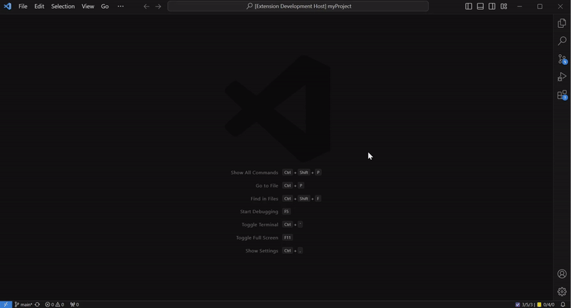
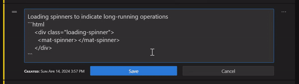
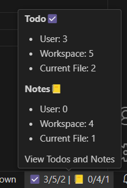

<h1 align="center">


VS Code Todo

</h1>

<h3 align="center">Todo lists, notes, markdown checklists, and reusable AI prompts for Visual Studio Code.</h3>

<p align="center">
  <!-- VS Code Marketplace -->
  <a href="https://marketplace.visualstudio.com/items?itemName=FrancescoAnzalone.vsc-todo">
    
  </a>
  <a href="https://marketplace.visualstudio.com/items?itemName=FrancescoAnzalone.vsc-todo">
    
  </a>
  <a href="https://marketplace.visualstudio.com/items?itemName=FrancescoAnzalone.vsc-todo">
  
  </a>
  <a href="https://marketplace.visualstudio.com/items?itemName=FrancescoAnzalone.vsc-todo">
    
  </a>
</p>

<p align="center">
  <a href="https://open-vsx.org/extension/FrancescoAnzalone/vsc-todo">
    
  </a>
  <a href="https://open-vsx.org/extension/FrancescoAnzalone/vsc-todo">
    
  </a>
  <a href="https://open-vsx.org/extension/FrancescoAnzalone/vsc-todo">
    
  </a>
</p>

  <!-- Project meta -->

<p align="center">
  
  <a href="https://prettier.io/">
    
  </a>
  <a href="https://eslint.org/">
    
  </a>

</p>

<p align="center">
  <a href="#getting-started">Getting started</a>
  ·
  <a href="https://github.com/ai-autocoder/vscode-todo/issues">Report an issue</a>
</p>

## Table of Contents
- [Introduction](#introduction)
- [Getting Started](#getting-started)
- [Key Features](#key-features)
  - [User, Workspace & File-specific Management](#user-workspace--file-specific-management)
  - [Sync Modes (User and Workspace)](#sync-modes-user-and-workspace)
  - [Markdown Support for Todos and Notes](#markdown-support-for-todos-and-notes)
  - [Syntax highlight](#syntax-highlight)
  - [Mermaid Diagram Support](#mermaid-diagram-support)
    - [Toggle Diagram Rendering](#toggle-diagram-rendering)
  - [KaTeX Math Support](#katex-math-support)
    - [Toggle Math Rendering](#toggle-math-rendering)
  - [Customizable Sorting](#customizable-sorting)
  - [Auto delete completed todos after a specified number of days](#auto-delete-completed-todos-after-a-specified-number-of-days)
  - [Collapsed item preview lines](#collapsed-item-preview-lines)
  - [Webview Font Settings](#webview-font-settings)
  - [Status Bar Integration](#status-bar-integration)
  - [Import from JSON / Markdown](#import-from-json--markdown)
    - [JSON](#json)
    - [Markdown](#markdown)
  - [Export to JSON / Markdown](#export-to-json--markdown)
- [Contributing](#contributing)
- [License](#license)
- [Support](#support)

## Introduction

**VS Code Todo** is a todo list and note-taking extension for Visual Studio Code. Capture project tasks, checklists, and meeting notes in one panel with Markdown, Mermaid diagrams, KaTeX math, and syntax highlighting. Organize items by User profile, workspace, or file scope, and open them instantly from the status bar or activity bar. Save reusable AI prompts, code review checklists, and meeting note templates alongside your tasks.

## Getting Started

After installing **VS Code Todo**, follow these steps to begin using the extension:

1. **Open the Todo Panel**

   - Click the status bar icon at the bottom of VS Code, or
   - Use the activity bar button on the left.  
     This will open the main panel.

2. **Select a Tab**

   - Use the three tabs at the top to choose where to store your items:
     - **User (per profile)**: tasks available across all workspaces in the current VS Code profile. By default they stay local; see [Sync Modes (User and Workspace)](#sync-modes-user-and-workspace) to enable roaming.
     - **Workspace**: tasks tied to the current project (default)
     - **File**: tasks associated with the active file

3. **Add a Todo**

   - Enter text in the input box at the bottom of the panel.
   - Press **Enter** to create the item.
   - The new todo will appear in the selected tab, either at the top or bottom of the list depending on your configuration.

4. **Manage Items**

   - Each item includes a menu button with the following options:
     - Change type between **Todo** and **Note**
     - Toggle rendering between plain text and markdown
     - Delete the item
   - Items can also be **reordered** by dragging and dropping them within the list.
   - Use **multi-item selection** for batch actions:
     - `Ctrl`/`Cmd`-click toggles individual items; hold `Shift` to select a range.
     - When a selection is active, the toolbar at the bottom lets you **Select all**, **Delete**, or **Clear**; press `Esc` to exit.

5. **Use the Toolbar**

   - The toolbar above the tabs provides options to:
     - Toggle wide view
     - Export or import data (JSON / Markdown)
     - Delete all items in the current tab
     - Delete completed todos

This covers the essentials; the sections below explore markdown previews, diagrams, automation, and more.

## Key Features

- **Todo and note scopes (profile, workspace, file)** keep personal, project, and file-linked checklists organised.
- **Markdown note-taking** with syntax highlighting, Mermaid diagrams, and KaTeX math for rich technical docs.
- **Keyboard-first capture** with quick add, drag-and-drop ordering, and multi-select bulk actions.
- **Status bar & activity bar access** keeps your task list one click away anywhere in VS Code.
- **Search, filters, and auto-cleanup** surface the next task and archive completed work automatically.
- **Import / export (JSON & Markdown)** to back up, share, or move your todos and notes.



### User, Workspace & File-specific Management

Tasks and notes are organized across three different scopes, each with its respective tab:

1. **User Tab**: Data available across all workspaces in the current VS Code profile. This data is isolated per profile. By default it stays local; see [Sync Modes (User and Workspace)](#sync-modes-user-and-workspace) to make it roam with Settings Sync.
2. **Workspace Tab**: Data tied to the current workspace.
3. **File-specific Tab**: Data associated with a **specific file** within the current workspace. The file displayed in this tab is **automatically updated** to reflect the **most recently focused file** in the editor. However, you can **pin** the tab to a specific file, preventing it from changing when you switch focus to other files.
Additionally, you can **manually select** and display data for any file that already has an associated record from the list on the left-hand side.

### Sync Modes (User and Workspace)

User lists support **Local**, **Profile Sync**, and **GitHub Gist**. Workspace lists support **Local** or **GitHub Gist**; when workspace sync is enabled, file-specific lists are stored in the same workspace gist file. Each mode stores data separately; switching modes does not migrate existing todos.

#### User: Local Mode (Default)

Your user todos stay on the current VS Code profile and device only. Best for device-specific lists or when you do not need cross-device sync.

#### User: Profile Sync Mode

Opt user lists into VS Code Settings Sync so they roam with the rest of your profile data. Change the mode from the header Sync menu (User tab) or via command **VS Code Todo: Select User Sync Mode** and choose "Profile Sync".

**Warning:** switching to Profile Sync syncs immediately with any other machine using the same VS Code profile and Settings Sync. Back up or export your data first if you need to keep separate copies.

#### GitHub Gist Sync Mode (User + Workspace)

Sync your todos via a **GitHub Gist**. This mode provides:

- **Cross-profile sync**: Use the same gist across multiple VS Code profiles and devices
- **Multiple lists**: Use different files within the gist (`user-Work.json`, `user-Personal.json`, etc.)
- **Workspace + file lists**: Workspace files also store file-specific todos for that workspace
- **Independent sync**: Works independently of VS Code Settings Sync
- **Guided setup**: Create a secret gist or pick an existing one from VS Code Todo
- **Manual control**: You can still manage the gist on GitHub or switch gists in Settings

##### Setup Instructions

**Quick Setup via Webview UI:**

1. **Connect GitHub**
   - Open the VS Code Todo panel and open the **Sync** menu in the header (sync pill)
   - Click **Connect to GitHub** and authenticate (requires `gist` scope)

2. **Choose your gist**
   - Select **Gist: Set ID...** in the Sync menu to open the setup picker
   - Pick **Create new secret gist** (creates empty user/workspace files), **Use existing gist...**, or **Open Settings...** to paste an ID manually

3. **Enable GitHub sync**
   - Switch to the **User** or **Workspace** tab, open the Sync menu, and select **GitHub Gist** for that scope
   - Choose **Change Gist file...** if you want a specific file for the current scope

Note: GitHub sync uses separate storage from Local/Profile modes. New gists start empty and do not copy your local lists. Use Export/Import if you want to migrate data.

**Alternative:** Use Command Palette commands (`Ctrl+Shift+P` / `Cmd+Shift+P`):

- **VS Code Todo: Connect GitHub**
- **VS Code Todo: Set Gist ID**
- **VS Code Todo: Select User Sync Mode** / **Select Workspace Sync Mode**
- **VS Code Todo: Set User File** / **Set Workspace File**
- **VS Code Todo: Sync Now**

The gist will store your todos in JSON files using hyphen prefixes:

- `user-*.json` - for user-scoped todos (e.g., `user-todos.json`, `user-Work.json`)
- `workspace-*.json` - for workspace and file-scoped todos (e.g., `workspace-ProjectA.json`)

##### Managing Your Gist

- **View on GitHub**: Run command **VS Code Todo: View Gist on GitHub** to open your gist in the browser
- **Sync Manually**: Run command **VS Code Todo: Sync Now** or click **Sync all now** in the Sync menu
- **Create New Files**:
  - Use the file selection commands (Set User File / Set Workspace File) and choose "Create New File"
  - Or create files manually on GitHub using the naming pattern: `user-Name.json` or `workspace-Name.json`
  - Workspace files are automatically prefilled with your workspace name
- **Rename Files**: Rename files on GitHub, then update your settings to point to the new file names

##### Status Bar Indicators

The status bar displays your sync status and todo counts:

**Sync Status Icons** (shown when GitHub sync is enabled):

- No icon - Synced and up-to-date
- ⚠️ Warning icon - Unsaved local changes pending sync
- ⟳ Spinning icon - Sync in progress
- ❌ Error icon - Sync error occurred

**Format**: `[icon] ☑️ user/workspace/file | 📒 user/workspace/file`

Hover over the status bar for detailed sync mode and counts breakdown.

##### Settings

Configure GitHub Gist sync with these settings:

```json
{
  // Your gist ID (32-character hex string from gist URL)
  // CRITICAL: Never commit this to source control!
  "vscodeTodo.sync.github.gistId": "0123456789abcdef0123456789abcdef",

  // User-scope file name in gist (uses hyphen prefix)
  "vscodeTodo.sync.github.userFile": "user-todos.json",

  // Workspace-scope file name in gist (auto-derived from workspace name if not set)
  "vscodeTodo.sync.github.workspaceFile": "workspace-ProjectAlpha.json",

  // Poll interval in seconds (min: 30, max: 600, default: 180)
  "vscodeTodo.sync.github.pollInterval": 180,

  // Only poll when Todo view is visible (saves battery & API rate limits)
  "vscodeTodo.sync.pollOnlyWhenVisible": true
}
```

**Note**: User and workspace sync modes are set via the Sync menu or commands (not settings): **Select User Sync Mode** and **Select Workspace Sync Mode**.

##### Security Warnings

- **Plaintext Storage**: Todos synced to GitHub are stored in **plaintext JSON**. Never store passwords, API keys, tokens, or sensitive personal information in synced todos.
- **Gist ID Sensitivity**: Your gist ID grants access to your todos. **Never commit** `.vscode/settings.json` containing your gist ID to source control. Add it to `.gitignore`.
- **Secret vs Public Gists**: Use **secret gists** (not public) to prevent your todos from being indexed by search engines. Secret gists are still accessible to anyone with the link.
- **Team Sharing**: When sharing a gist with teammates, understand that all members with the gist ID can read and write todos. Coordinate to avoid conflicts.

##### Conflict Resolution

The extension uses **three-way, content-based conflict detection** to protect your data:

**Automatic Resolution:**

- Remote changed, local clean -> downloads remote changes
- Local changed, remote unchanged -> uploads local changes after 3-second debounce
- Both unchanged -> no sync needed

**True Conflicts** (both local and remote have changes):

- For **user lists**, a conflict wizard lets you resolve each conflict, keep all local, keep all remote, or view the gist on GitHub.
- For **workspace lists**, file path conflicts show **Keep Local Files** / **Keep Remote Files** / **View Gist**, then todo conflicts use the same wizard.

**Best Practices:**

- The extension syncs automatically when you open the view and polls periodically based on your `pollInterval` setting (default: every 3 minutes)
- Use **Sync all now** (Sync menu) or **Sync Now** (command) before making major changes if coordinating across multiple devices
- Export your todos regularly as backups

##### Troubleshooting

**"Not authenticated"**
- Run **VS Code Todo: Connect GitHub** and sign in

**"Gist ID not configured"**
- Run **VS Code Todo: Set Gist ID** or set `vscodeTodo.sync.github.gistId` in Settings (User or Workspace)

**"File not found in gist"**
- The file will be auto-created on first sync, or create it manually on GitHub

**Sync not happening**
- Check status bar for error indicators
- Run **VS Code Todo: Sync Now** or click **Sync all now** in the Sync menu
- Verify the Todo view is visible (polling only happens when visible by default)
- Check `vscodeTodo.sync.pollOnlyWhenVisible` setting if you need 24/7 background sync

**Conflicts keep appearing**
- The extension uses content-based detection to avoid false positives
- True conflicts only occur when both you and another user (or device) modify the same data
- Use the conflict wizard to resolve each conflict, or select **Keep All Local** / **Keep All Remote** / **View Gist**

### Markdown Support for Todos and Notes

Create todos and notes with rich markdown formatting, allowing for more organized and readable content.

It is possible to individually switch rendering between **text** and **markdown** in the options menu of each item in the list.



### Syntax highlight

When rendering in markdown, you can include code snippets with syntax highlighting.

 This is supported by ngx-markdown and the underlying [PrismJS](https://prismjs.com/#supported-languages) library, which supports hundreds of programming languages.

To create a note with code highlighting, use the standard markdown syntax.

For example, to highlight TypeScript code:

````markdown
```typescript
    const myProp: string = 'value';
    console.log(myProp);
​```
````

<details>
<summary>Supported Syntax Highlighting Languages (click to expand)</summary>

| Markup & SGML         | Programming Languages | Scripting & Markup     | Data Format & DB | Systems & Config         | Miscellaneous       |
| --------------------- | --------------------- | ---------------------- | ---------------- | ------------------------ | ------------------- |
| HTML, XML             | C, C++, C#            | JavaScript, TypeScript | JSON, JSON5      | Bash, Shell              | Markdown, YAML      |
| SVG, MathML           | Java, Kotlin          | Python, Ruby           | SQL, GraphQL     | Apache Configuration     | Docker, Dockerfile  |
| SSML, Atom, RSS       | Go, Rust              | PHP, ASP.NET           | CSV, TOML        | nginx, Systemd           | Git, Regex          |
| Ada, Agda             | Swift, Scala          | Perl, Lua              | Protocol Buffers | HTTP, HPKP               | LaTeX, Tex, Context |
| ABAP, ActionScript    | Haskell, Clojure      | R, MATLAB              | GraphQL          | .ignore (gitignore)      | WebAssembly, WebGL  |
| ANTLR4, G4            | Objective-C, Dart     | Elixir, Erlang         |                  | EditorConfig             | ASN.1, CSP          |
| Apex, APL             | F#, Ocaml             | PowerShell             |                  | INI, DNS Zone File       | VHDL, Verilog       |
| AppleScript, AQL      | Groovy, Ruby          | Shell Session          |                  | Robot Framework          | Mermaid, PlantUML   |
| Arduino, ARM Assembly | Fortran, COBOL        | AutoHotkey, AutoIt     |                  | Puppet, Bicep            | GameMaker Language  |
| Arturo, AsciiDoc      | Haskell, TypeScript   | Lua, MoonScript        |                  | AWS, Google Cloud Config | Gherkin, GraphQL    |
| ASP.NET (C#)          | Julia, Rust           | Tcl, Terraform         |                  | Ansible, Terraform       | Diff, Patch         |
| Assembly (Various)    | Nim, Crystal          | Scheme, Lisp           |                  | Kubernetes, Docker       | UML, DOT (Graphviz) |
| AWK, GAWK             | Perl, PHP             | Swift, VB.Net          |                  | Prometheus, Grafana      | XMPP, IRC           |
| Bison, BNF, RBNF      | Prolog, Python        | TypeScript             |                  | Nagios, Zabbix           | LaTeX, SAS, R       |

_Note: This table represents a subset of the languages supported by PrismJS. For a full list, please refer to the [PrismJS supported languages page](https://prismjs.com/#supported-languages)._

</details>

### Mermaid Diagram Support

You can create diagrams and charts using [Mermaid](https://mermaid-js.github.io/mermaid/#/) syntax. To render a Mermaid diagram, ensure that the "View as Markdown" option is selected for the item, and then wrap your Mermaid code in a `mermaid` block:

````markdown

````

#### Toggle Diagram Rendering

If you prefer to see Mermaid code with syntax highlighting instead of rendered diagrams, set the following setting in your VS Code settings:

```json
"vscodeTodo.enableMarkdownDiagrams": false
```

When disabled, Mermaid code blocks render as regular code with Prism highlighting; when enabled (default), they render as diagrams.

### KaTeX Math Support

Render mathematical expressions using [KaTeX](https://katex.org/) in Markdown items. Enable "View as Markdown" for the item, then use KaTeX delimiters. Math is not rendered inside fenced code blocks (```), so do not wrap math in triple backticks.

- Inline math: `$a^2 + b^2 = c^2$`
- Block math (put on separate lines, no backticks):

  $$
  \int_0^\infty e^{-x^2}\,dx = \frac{\sqrt{\pi}}{2}
  $$

Supported delimiters include `$...$`, `$$...$$`, `\( ... \)`, and `\[ ... \]`.

#### Toggle Math Rendering

To disable KaTeX rendering and show math delimiters as plain text with syntax highlighting instead, set the following setting in VS Code:

```json
"vscodeTodo.enableMarkdownKatex": false
```

When enabled (default), inline `$...$` and block `$$...$$` expressions render as KaTeX. If you see a code block instead, remove surrounding triple backticks—KaTeX does not render inside code fences.

### Customizable Sorting

You can personalize how the completed tasks are sorted, with two sorting options and the ability to disable sorting as needed.

To define the sorting options:

- **sortType1**: Moves completed todos to the bottom, just on top of the first completed todo.
- **sortType2**: Similar to Type 1, but groups completed todos with notes, useful for maintaining contextual relationships.
- **disabled**: Completed todos remain in place, allowing full manual control of the order.

The default sorting option is **sortType1**.

```json
"vscodeTodo.taskSortingOptions": "sortType1"
```

### Auto delete completed todos after a specified number of days

You can configure the extension to automatically delete completed todos after a specified number of days. This feature helps keep your task list clean and manageable.
To enable this feature, set the `vscodeTodo.autoDeleteCompletedAfterDays` configuration option to the desired number of days. Set it to `0` to disable auto-deletion.

```json
"vscodeTodo.autoDeleteCompletedAfterDays": 7
```

### Collapsed item preview lines

Control how many lines are shown when an item is collapsed. Set `vscodeTodo.collapsedPreviewLines` to the desired number of lines (minimum 1). Default is 1.

```json
"vscodeTodo.collapsedPreviewLines": 2
```

### Webview Font Settings

Control the webview's typography with two settings:

- `vscodeTodo.webviewFontFamily`: CSS font-family string. Leave empty to inherit VS Code's font.
- `vscodeTodo.webviewFontSize`: Number in pixels. Set `0` to inherit VS Code's editor font size.

Example:

```json
"vscodeTodo.webviewFontFamily": "'Fira Code', Consolas, 'Courier New', monospace",
"vscodeTodo.webviewFontSize": 18
```

### Status Bar Integration

View and access your task and note count from the status bar, with a hover tooltip providing a detailed breakdown.



### Import from JSON / Markdown

Use **Command palette**:

- `Import data from JSON` or
- `Import data from Markdown`

**Requirements:**

- The file to import must be in the workspace root folder.

**Behavior:**

#### JSON

- If an `id` matches an existing record, the provided values will override the existing ones. Otherwise, a new record will be added.
- `text` is the only required property (and the `file path` for file-specific records).

<details>
<summary>JSON example (click to expand)</summary>

```json
{
  "user": [
    { /* if the id matches an existing record, the provided values will override the existing ones. */
      "id": 1234567890123456,
      "text": "Complete the project documentation",
      "completed": false,
      "isMarkdown": true,
      "isNote": false,
      "creationDate": "2024-05-19T12:34:56.789Z"
    },
    { 
      /* if the id is not provided or does not match an existing record, a new record is added. */
      "text": "Review pull requests",
    }
  ],
  "workspace": [
    {
      "id": 3456789012345678,
      "text": "Set up new workspace",
      "completed": false,
      "isMarkdown": false,
      "isNote": true,
      "creationDate": "2024-05-20T10:00:00.789Z"
    }
  ],
  "files": {
    "c:\\Users\\username\\Documents\\project\\README.md": [
      {
        "id": 4567890123456789,
        "text": "Add installation instructions",
        "completed": false,
        "isMarkdown": true,
        "isNote": false,
        "creationDate": "2024-05-18T14:22:33.456Z"
      }
    ],
    "c:\\Users\\username\\Documents\\project\\src\\main.js": [
      {
        "id": 5678901234567890,
        "text": "Refactor main function",
        "completed": true,
        "isMarkdown": false,
        "isNote": false,
        "creationDate": "2024-05-17T16:00:00.789Z",
        "completionDate": "2024-05-17T18:30:00.123Z"
      }
    ]
  }
}
```

</details>

#### Markdown

- Imported records will be added to the existing ones.

### Export to JSON / Markdown

You can export data by using the **Command palette**:

- Select  `Export data to JSON` or
- Select  `Export data to Markdown`

The exported file will be saved in the root folder of your workspace.

## Contributing

Contributions are welcome! Please submit pull requests, report bugs, or suggest enhancements via the [GitHub repository](https://github.com/ai-autocoder/vscode-todo).

## License

Distributed under the MIT License. See `LICENSE` for more information.

## Support

For support, feature requests, or bug reporting, please visit the [GitHub issues page](https://github.com/ai-autocoder/vscode-todo/issues).

## Important Notice

**Data Safety**: This extension is provided "as-is" under the MIT License. While we strive for reliability, we recommend maintaining regular backups of your todos using the export feature. The GitHub Gist sync feature depends on GitHub's service availability and uses content-based conflict detection with user choice dialogs to protect your data during simultaneous edits across devices.

**Security**: Never store passwords, API keys, tokens, or other sensitive information in your todos. Data synced to GitHub Gists is stored in plaintext JSON format.

**Backups**: Use the "Export to JSON" or "Export to Markdown" commands regularly to maintain local backups of your data. See our [Security Warnings](#security-warnings) section for more details.

---

**Legal**: [DISCLAIMER](DISCLAIMER.md) | [LICENSE](LICENSE)
