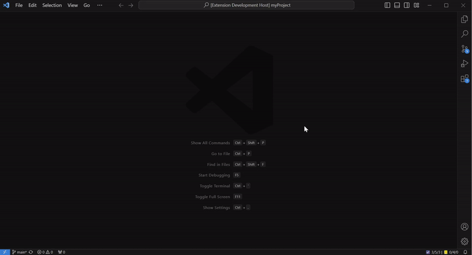
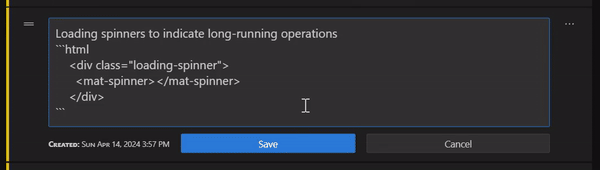
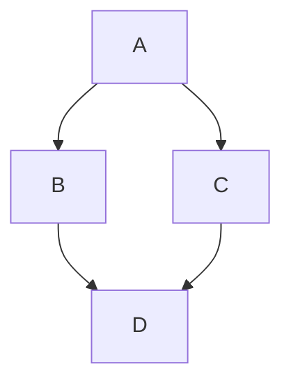
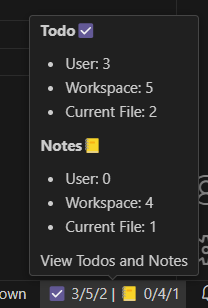

<h1 align="center">


VS Code Todo

</h1>

<h3 align="center">Todo lists, notes, markdown checklists, and reusable AI prompts for Visual Studio Code with GitHub Gist sync.</h3>

<p align="center">
  <!-- VS Code Marketplace -->
  <a href="https://marketplace.visualstudio.com/items?itemName=FrancescoAnzalone.vsc-todo">
    
  </a>
  <a href="https://marketplace.visualstudio.com/items?itemName=FrancescoAnzalone.vsc-todo">
    
  </a>
  <a href="https://marketplace.visualstudio.com/items?itemName=FrancescoAnzalone.vsc-todo">
  
  </a>
  <a href="https://marketplace.visualstudio.com/items?itemName=FrancescoAnzalone.vsc-todo">
    
  </a>
</p>

<p align="center">
  <a href="https://open-vsx.org/extension/FrancescoAnzalone/vsc-todo">
    
  </a>
  <a href="https://open-vsx.org/extension/FrancescoAnzalone/vsc-todo">
    
  </a>
  <a href="https://open-vsx.org/extension/FrancescoAnzalone/vsc-todo">
    
  </a>
</p>

  <!-- Project meta -->

<p align="center">
  
  <a href="https://prettier.io/">
    
  </a>
  <a href="https://eslint.org/">
    
  </a>

</p>

<p align="center">
  <a href="#getting-started">Getting started</a>
  |
  <a href="https://github.com/ai-autocoder/vscode-todo/issues">Report an issue</a>
</p>

## Table of Contents
- [Introduction](#introduction)
- [Getting Started](#getting-started)
- [Key Features](#key-features)
  - [User, Workspace & File-specific Management](#user-workspace--file-specific-management)
  - [Sync Modes (User and Workspace)](#sync-modes-user-and-workspace)
  - [MCP Server (AI Agent Integration)](#mcp-server-ai-agent-integration)
  - [Markdown Support for Todos and Notes](#markdown-support-for-todos-and-notes)
  - [Syntax Highlighting](#syntax-highlighting)
  - [Mermaid Diagram Support](#mermaid-diagram-support)
  - [KaTeX Math Support](#katex-math-support)
  - [Customizable Sorting](#customizable-sorting)
  - [Tags](#tags)
  - [Auto delete completed todos after a specified number of days](#auto-delete-completed-todos-after-a-specified-number-of-days)
  - [Collapsed item preview lines](#collapsed-item-preview-lines)
  - [Webview Font Settings](#webview-font-settings)
  - [Status Bar Integration](#status-bar-integration)
  - [Import from JSON / Markdown](#import-from-json--markdown)
  - [Export to JSON / Markdown](#export-to-json--markdown)
- [Contributing](#contributing)
- [License](#license)
- [Support](#support)

## Introduction

**VS Code Todo** is a todo list and note-taking extension for Visual Studio Code. Capture tasks, checklists, and notes with Markdown, Mermaid diagrams, KaTeX math, and syntax highlighting, organized by profile, workspace, or file and accessible from the status bar or activity bar. Sync via GitHub Gist or VS Code Settings Sync, and store reusable AI prompts, code review checklists, and meeting note templates alongside your tasks.

## Getting Started

Quick start:

1. **Open the Todo Panel**

   - Status bar icon or activity bar button.

2. **Select a Tab**

   - Pick where items live:
     - **User (per profile)**: tasks across all workspaces in the current profile (local by default; see [Sync Modes (User and Workspace)](#sync-modes-user-and-workspace)).
     - **Workspace**: tasks for the current project (default)
     - **File**: tasks for the active file (can be pinned)

3. **Add a Todo**

   - Enter text in the input box and press **Enter**.

4. **Manage Items**

   - Item menu (Todo/Note, markdown, delete); drag to reorder; multi-select for batch actions (`Ctrl`/`Cmd`, `Shift`).

5. **Use the Toolbar**

   - Wide view, import/export (JSON / Markdown), bulk delete.

## Key Features

- **Todo and note scopes (profile, workspace, file)** keep personal, project, and file-linked checklists organised.
- **Cloud sync via GitHub Gist** keeps user/workspace lists in sync across devices and profiles.
- **Local MCP server for AI agents** exposes your todos via the Model Context Protocol with optional read-only and scope restrictions.
- **Markdown note-taking** with syntax highlighting, Mermaid diagrams, and KaTeX math for rich technical docs.
- **Keyboard-first capture** with quick add, drag-and-drop ordering, and multi-select bulk actions.
- **Status bar & activity bar access** keeps your task list one click away anywhere in VS Code.
- **Search, filters, and auto-cleanup** surface the next task and archive completed work automatically.
- **Import / export (JSON & Markdown)** to back up, share, or move your todos and notes.



### User, Workspace & File-specific Management

Tasks and notes live in three scopes:

1. **User Tab**: Data across all workspaces in the current profile (local by default; see [Sync Modes (User and Workspace)](#sync-modes-user-and-workspace)).
2. **Workspace Tab**: Data tied to the current workspace.
3. **File-specific Tab**: Data for the active file. The tab follows the most recently focused file, but you can pin it or pick another file from the list.

File-specific lists match absolute paths; if a workspace-relative alias exists, they also match relative paths (useful for gist sync).

### Sync Modes (User and Workspace)

User lists support **Local**, **Profile Sync**, and **GitHub Gist**. Workspace lists support **Local** or **GitHub Gist**; file lists live in the workspace gist file. Each mode stores data separately, so switching modes does not migrate existing todos.

#### User: Local Mode (Default)

Your user todos stay on the current VS Code profile and device only.

#### User: Profile Sync Mode

Syncs user lists with VS Code Settings Sync. Change the mode from the header Sync menu (User tab) or via **VS Code Todo: Select User Sync Mode**.

**Warning:** Profile Sync runs immediately on other machines using the same profile. Export first if you need separate copies.

#### GitHub Gist Sync Mode (User + Workspace)

Sync your todos via a **GitHub Gist**. This mode provides:

- **Cross-profile sync** across devices
- **Multiple lists** using different files within the gist (`user-Work.json`, `user-Personal.json`, etc.)
- **Workspace + file lists** stored in the same workspace file
- **Independent sync** from VS Code Settings Sync

##### Setup

1. **Connect GitHub**: Open the **Sync** menu in the header and authenticate (requires `gist` scope).
2. **Choose your gist**: **Gist: Set ID...** -> create secret gist, use existing, or open settings to paste an ID.
3. **Enable GitHub sync**: In the **User** or **Workspace** tab, select **GitHub Gist**; optionally **Change GitHub Gist list...**.

Note: GitHub sync is separate from Local/Profile modes. New gists start empty; use Export/Import to migrate data.

Command Palette commands:

- **VS Code Todo: Connect GitHub**
- **VS Code Todo: Set Gist ID**
- **VS Code Todo: Select User Sync Mode** / **Select Workspace Sync Mode**
- **VS Code Todo: Change User List (GitHub Gist)...** / **Change Workspace List (GitHub Gist)...**
- **VS Code Todo: Sync Now**

Gist file names use hyphen prefixes:

- `user-*.json` - for user-scoped todos (e.g., `user-todos.json`, `user-Work.json`)
- `workspace-*.json` - for workspace and file-scoped todos (e.g., `workspace-ProjectA.json`)

##### Managing Your Gist

- **View on GitHub**: **VS Code Todo: View Gist on GitHub**
- **Sync Manually**: **VS Code Todo: Sync Now** or **Sync all now** in the Sync menu
- **Create New Lists**: Use the list selection commands or create `user-Name.json` / `workspace-Name.json` on GitHub.
- **Rename Files**: Rename on GitHub, then update settings to point to the new file names.

**Sync Status Icons** (GitHub sync): synced, pending changes, syncing, error.

##### Settings

Configure GitHub Gist sync with these settings:

```json
{
  // Gist ID (32-character hex string from gist URL). Never commit this.
  "vscodeTodo.sync.github.gistId": "0123456789abcdef0123456789abcdef",

  // User-scope file name in gist (uses hyphen prefix)
  "vscodeTodo.sync.github.userFile": "user-todos.json",

  // Workspace-scope file name in gist (auto-derived from workspace name if not set)
  "vscodeTodo.sync.github.workspaceFile": "workspace-ProjectAlpha.json",

  // Poll interval in seconds (min: 30, max: 600, default: 180)
  "vscodeTodo.sync.github.pollInterval": 180,

  // Only poll when Todo view is visible (saves battery & API rate limits)
  "vscodeTodo.sync.pollOnlyWhenVisible": true
}
```

**Note**: User and workspace sync modes are set via the Sync menu or commands (not settings): **Select User Sync Mode** and **Select Workspace Sync Mode**.

##### Security Warnings

- **Plaintext Storage**: Todos synced to GitHub are stored in **plaintext JSON**. Never store passwords, API keys, tokens, or sensitive personal information.
- **Gist ID Sensitivity**: Your gist ID grants access to your todos. **Never commit** `.vscode/settings.json` containing your gist ID.
- **Sharing**: Use **secret gists** and remember that anyone with the gist ID can read and write your todos.

##### Conflict Resolution

The extension uses **three-way, content-based conflict detection** to protect your data.

**Automatic Resolution:** remote changed -> download; local changed -> upload after 3-second debounce; both unchanged -> no sync.

**True Conflicts** (both local and remote have changes):

- **User lists**: conflict wizard lets you resolve each conflict, keep all local, keep all remote, or view the gist on GitHub.
- **Workspace lists**: file path conflicts show **Keep Local Files** / **Keep Remote Files** / **View Gist**, then todo conflicts use the same wizard.

**Best Practices:**

- Syncs automatically when you open the view and polls periodically (default: every 3 minutes)
- Use **Sync all now** (Sync menu) or **Sync Now** (command) before major changes

##### Troubleshooting

**"Not authenticated"**
- Run **VS Code Todo: Connect GitHub** and sign in

**"Gist ID not configured"**
- Run **VS Code Todo: Set Gist ID** or set `vscodeTodo.sync.github.gistId` in Settings (User or Workspace)

**"File not found in gist"**
- The file will be auto-created on first sync, or create it manually on GitHub

**Sync not happening**
- Check status bar for error indicators
- Run **VS Code Todo: Sync Now** or click **Sync all now** in the Sync menu
- Verify the Todo view is visible (polling only happens when visible by default)
- Check `vscodeTodo.sync.pollOnlyWhenVisible` setting if you need 24/7 background sync

**Conflicts keep appearing**
- The extension uses content-based detection to avoid false positives
- True conflicts only occur when both you and another user (or device) modify the same data
- Use the conflict wizard to resolve each conflict, or select **Keep All Local** / **Keep All Remote** / **View Gist**

### MCP Server (AI Agent Integration)

VS Code Todo can run a local [Model Context Protocol](https://modelcontextprotocol.io/) (MCP) server so AI agents — Claude Code, Claude Desktop, Cursor, or any MCP-capable client — can read and manage your todos and notes directly, without you copy-pasting them into chat.

Once connected, you can ask an agent to:

- **Capture work as you go**: _"Add a todo to refactor the auth module."_ or _"Save these release steps as a note in the workspace list."_
- **Plan from your lists**: _"What's still open in my workspace todos? Suggest an order to tackle them."_
- **Keep lists tidy**: _"Mark the 'update changelog' todo as done."_ or _"Delete the completed items in this file's list."_
- **Turn code findings into tasks**: _"Review this file and add a todo for each TODO comment you find."_

The server is **read-only by default** and binds only to loopback (`127.0.0.1`), so nothing is exposed to the network and agents can't change anything until you opt in to writes.

#### Quick start

1. **Enable the server** (User or Workspace settings):

   ```json
   {
     "vscodeTodo.mcp.enabled": true,
     // Set false to let agents add/edit/delete (default: true = read-only).
     "vscodeTodo.mcp.readOnly": true,
     // Listen port. Use 0 for a random free port.
     "vscodeTodo.mcp.port": 7337,
     // Optional shared-secret token. Leave empty to disable auth.
     "vscodeTodo.mcp.token": ""
   }
   ```

   Or run **VS Code Todo: Start MCP Server** from the Command Palette (and **Stop MCP Server** to turn it off). The **workspace must be trusted**.

2. **Connect your agent.** The server speaks streamable HTTP at `http://127.0.0.1:<port>/mcp`. Send `Authorization: Bearer <token>` if you set a token.

   For **Claude Code**:

   ```bash
   claude mcp add --transport http vscode-todo http://127.0.0.1:7337/mcp
   # With a token:
   claude mcp add --transport http vscode-todo http://127.0.0.1:7337/mcp \
     --header "Authorization: Bearer YOUR_TOKEN"
   ```

   For clients that use a JSON config (Claude Desktop, Cursor, `.mcp.json`):

   ```json
   {
     "mcpServers": {
       "vscode-todo": {
         "type": "http",
         "url": "http://127.0.0.1:7337/mcp",
         "headers": { "Authorization": "Bearer YOUR_TOKEN" }
       }
     }
   }
   ```

3. **Ask away** using the example prompts above. The agent discovers the available actions automatically.

#### Capabilities

The agent works with three lists (scopes), matching the extension's tabs:

- **user** — your global list, shared across all projects
- **workspace** — the current project's list
- **currentFile** — todos attached to a specific file (the agent passes the file path)

It can **list** todos and notes (with filtering and paging, including by `tag`), **add** todos/notes — one at a time or as an ordered batch that preserves the given order (handy for laying down a multi-step plan) — **edit** text, **complete/reopen** todos, **convert** between task and note, **toggle Markdown** rendering, **tag** items to group them (e.g. all steps of a plan, then track progress with a tag-scoped count), and **delete** items. All edits are rejected while `readOnly` is `true`.

You can also narrow what's reachable with `vscodeTodo.mcp.allowedScopes` (default `["user", "workspace", "file"]`) — e.g. drop `"file"` so agents can't touch per-file lists.

#### Tips for `CLAUDE.md` / agent instructions

<details>
<summary>Add a note to your project's <code>CLAUDE.md</code> / <code>AGENTS.md</code> (click to expand)</summary>

Drop this into your project's `CLAUDE.md`, `AGENTS.md`, or equivalent so the agent uses the
lists consistently — and only when the work actually calls for it (so it doesn't read your
todos on every unrelated turn):

```markdown
## Task tracking (VS Code Todo MCP)

When the `todo_*` tools are connected, the MCP is this project's task tracker. Reach for it
when the task at hand actually involves tracked work — don't call it on every turn:

- **When the user refers to tasks, todos, plans, or "what's next"** (or you need to find
  existing tracked work), read with `todo_list_items` / `todo_count_items` (`workspace` scope)
  before searching the repo — the MCP is the source of truth for outstanding work.
- **When you produce a multi-step plan worth keeping**, save it with `todo_add_items`
  (`workspace`) and tag every step with one shared plan tag via `todo_set_tags`; re-read it
  with the `tag` filter.
- **When you finish a tracked step**, mark it with `todo_set_completed` (don't delete).

Skip it for quick questions or one-off edits that aren't about tracked work. Each tool's
description covers scopes, notes, filtering, and read-only behavior.
```

For read-only setups (`vscodeTodo.mcp.readOnly: true`), drop the "save"/"mark" lines and keep
only the "read existing tracked work" guidance.

</details>

<details>
<summary>Full tool &amp; resource reference (click to expand)</summary>

**Tools** — most tools take a `scope` of `user`, `workspace`, or `currentFile` (for `currentFile`, also pass `filePath`); `todo_count_items` and `todo_list_files` span all scopes and take no `scope`. Write tools are rejected in read-only mode.

| Tool | What it does |
| --- | --- |
| `todo_list_items` | List todos/notes for a scope. Optional filters: `kind` (`task`/`note`/`all`), `completed` (open/done), `textPrefix` (prefix match), `search` (substring match anywhere in the text), `tag` (only items carrying that tag — pulls up a whole plan/group). Optional ordering: `sortBy` (`creationDate`/`completionDate`/`completed`) and `order` (`asc`/`desc`). Paginated (`limit` default 50, max 500; `offset`); a page is also capped by a character budget (`maxChars`), so it may return fewer than `limit` items with `has_more` set — item text is never truncated. |
| `todo_count_items` | Return todo/note counts per scope (no arguments) — a cheap overview of where the open work is before paging a scope. Pass an optional `tag` to count only items carrying that tag; each scope then also reports a `completed` count, giving tag-scoped progress (e.g. "3 of 9 done"). |
| `todo_list_files` | List workspace files that have file-scoped todos, with per-file counts; paginated. |
| `todo_add_item` | Create a todo or note (`isNote`, `isMarkdown` optional). Optional `position` (`top`/`bottom`) overrides the `createPosition` setting for this call; omit it to use the setting. _Write._ |
| `todo_add_items` | Create several todos/notes in one call from an ordered `items` array, preserving the given order — use it to lay down an ordered list (e.g. a multi-step plan) without the list coming out reversed. Each item may set its own `isNote`/`isMarkdown`; optional `position` (`top`/`bottom`, default `bottom`) places the whole block while keeping its order. _Write._ |
| `todo_update_text` | Change an item's text by `id`. _Write._ |
| `todo_set_completed` | Mark a todo completed/reopened by `id`. _Write._ |
| `todo_set_note` | Convert an item between task and note by `id`. _Write._ |
| `todo_set_markdown` | Toggle Markdown rendering for an item by `id`. _Write._ |
| `todo_set_tags` | Replace an item's tags by `id` with a given list (tags are normalized; an empty list clears them). Tag related items — e.g. every step of a plan — then read them back with the `tag` filter. _Write._ |
| `todo_delete_items` | Delete one or more items by their `ids`. _Write._ |

**Resources** — read-only JSON snapshots of the same data:

- `todo://user`, `todo://workspace` — todos/notes for each scope
- `todo://counts` — todo/note counts by scope
- `todo://files` — files that have todos
- `todo://file?path=<path>` — todos for a specific file

Both tools and resources honor `allowedScopes`. There is also a `vscodeTodo.mcp.transport` setting, which currently only supports `"streamableHttp"`.

</details>

### Markdown Support for Todos and Notes

Create todos and notes with rich markdown formatting. You can switch rendering between **text** and **markdown** per item from the options menu.



### Syntax Highlighting

When rendering in markdown, you can include code snippets with syntax highlighting. This is supported by ngx-markdown and [PrismJS](https://prismjs.com/#supported-languages), which supports hundreds of languages.

For example, to highlight TypeScript code:

````markdown
```typescript
const myProp: string = 'value';
console.log(myProp);
```
````

<details>
<summary>Supported Syntax Highlighting Languages (click to expand)</summary>

| Markup & SGML         | Programming Languages | Scripting & Markup     | Data Format & DB | Systems & Config         | Miscellaneous       |
| --------------------- | --------------------- | ---------------------- | ---------------- | ------------------------ | ------------------- |
| HTML, XML             | C, C++, C#            | JavaScript, TypeScript | JSON, JSON5      | Bash, Shell              | Markdown, YAML      |
| SVG, MathML           | Java, Kotlin          | Python, Ruby           | SQL, GraphQL     | Apache Configuration     | Docker, Dockerfile  |
| SSML, Atom, RSS       | Go, Rust              | PHP, ASP.NET           | CSV, TOML        | nginx, Systemd           | Git, Regex          |
| Ada, Agda             | Swift, Scala          | Perl, Lua              | Protocol Buffers | HTTP, HPKP               | LaTeX, Tex, Context |
| ABAP, ActionScript    | Haskell, Clojure      | R, MATLAB              | GraphQL          | .ignore (gitignore)      | WebAssembly, WebGL  |
| ANTLR4, G4            | Objective-C, Dart     | Elixir, Erlang         |                  | EditorConfig             | ASN.1, CSP          |
| Apex, APL             | F#, Ocaml             | PowerShell             |                  | INI, DNS Zone File       | VHDL, Verilog       |
| AppleScript, AQL      | Groovy, Ruby          | Shell Session          |                  | Robot Framework          | Mermaid, PlantUML   |
| Arduino, ARM Assembly | Fortran, COBOL        | AutoHotkey, AutoIt     |                  | Puppet, Bicep            | GameMaker Language  |
| Arturo, AsciiDoc      | Haskell, TypeScript   | Lua, MoonScript        |                  | AWS, Google Cloud Config | Gherkin, GraphQL    |
| ASP.NET (C#)          | Julia, Rust           | Tcl, Terraform         |                  | Ansible, Terraform       | Diff, Patch         |
| Assembly (Various)    | Nim, Crystal          | Scheme, Lisp           |                  | Kubernetes, Docker       | UML, DOT (Graphviz) |
| AWK, GAWK             | Perl, PHP             | Swift, VB.Net          |                  | Prometheus, Grafana      | XMPP, IRC           |
| Bison, BNF, RBNF      | Prolog, Python        | TypeScript             |                  | Nagios, Zabbix           | LaTeX, SAS, R       |

_Note: This table represents a subset of the languages supported by PrismJS. For a full list, please refer to the [PrismJS supported languages page](https://prismjs.com/#supported-languages)._

</details>

### Mermaid Diagram Support

You can create diagrams and charts using [Mermaid](https://mermaid-js.github.io/mermaid/#/) syntax. To render a Mermaid diagram, switch the item to markdown and wrap your Mermaid code in a `mermaid` block:

````markdown

```mermaid
graph TD;
    A-->B;
    A-->C;
    B-->D;
    C-->D;
```
````

#### Toggle Diagram Rendering

To show Mermaid code instead of rendered diagrams, set:

```json
"vscodeTodo.enableMarkdownDiagrams": false
```

### KaTeX Math Support

Render mathematical expressions using [KaTeX](https://katex.org/) in Markdown items. Enable "View as Markdown" for the item, then use KaTeX delimiters. Math is not rendered inside fenced code blocks (```).

- Inline math: `$a^2 + b^2 = c^2$`
- Block math (put on separate lines, no backticks):

  $$
  \int_0^\infty e^{-x^2}\,dx = \frac{\sqrt{\pi}}{2}
  $$

Supported delimiters include `$...$`, `$$...$$`, `\( ... \)`, and `\[ ... \]`.

#### Toggle Math Rendering

To show math delimiters as plain text, set:

```json
"vscodeTodo.enableMarkdownKatex": false
```

### Customizable Sorting

Sorting options:

- **sortType1**: Moves completed todos to the bottom, just on top of the first completed todo.
- **sortType2**: Similar to Type 1, but groups completed todos with notes, useful for maintaining contextual relationships.
- **disabled**: Completed todos remain in place, allowing full manual control of the order.

Default: **sortType1**.

```json
"vscodeTodo.taskSortingOptions": "sortType1"
```

### Tags

Tag any todo or note to group related items — for example, label every step of a plan with the same tag, then pull the whole group up at once and track its progress.

- **Add or remove tags**: open an item for editing; a tag input appears next to the dates in the edit footer. Type a tag and press **Enter** (or click away) to add it — you can also enter a comma-separated list and it's split into several tags. Click the **×** on a chip, or press **Backspace** in an empty input, to remove one. Tags are normalized automatically (trimmed, de-duplicated case-insensitively, with a sensible length/count cap).
- **Show Tags**: tag chips are hidden by default to keep dense lists clean. Turn them on from the gear/settings menu (**Show Tags** / **Hide Tags**), or set `vscodeTodo.showTags` directly. Chips then appear under each item in both the collapsed and expanded views.
- **Filter by tag**: click a chip to filter the list to that tag, or type `tag:<name>` in the search box. A plain search query also matches tags (not just the item text); a `tag:` query matches **only** tags, so it pulls up exactly the items in that plan/group.

Tags are part of the item, so they sync and round-trip through JSON export/import like any other field. AI agents can read and set them through the MCP server (the `tag` filter on `todo_list_items` / `todo_count_items` and the `todo_set_tags` tool — see [MCP Server (AI Agent Integration)](#mcp-server-ai-agent-integration)), so a plan laid down by an agent and one tagged by hand share the same grouping.

```json
"vscodeTodo.showTags": true
```

### Auto delete completed todos after a specified number of days

Set `vscodeTodo.autoDeleteCompletedAfterDays` to the number of days, or `0` to disable.

```json
"vscodeTodo.autoDeleteCompletedAfterDays": 7
```

### Collapsed item preview lines

Set `vscodeTodo.collapsedPreviewLines` to the number of lines (minimum 1, default 1).

```json
"vscodeTodo.collapsedPreviewLines": 2
```

### Webview Font Settings

Webview typography settings:

- `vscodeTodo.webviewFontFamily`: CSS font-family string. Leave empty to inherit VS Code's font.
- `vscodeTodo.webviewFontSize`: Number in pixels. Set `0` to inherit VS Code's editor font size.

Example:

```json
"vscodeTodo.webviewFontFamily": "'Fira Code', Consolas, 'Courier New', monospace",
"vscodeTodo.webviewFontSize": 18
```

### Status Bar Integration

Status bar shows task and note counts.



### Import from JSON / Markdown

Command Palette: `Import data from JSON` or `Import data from Markdown`.

Import file must be in the workspace root. JSON import is lossless (preserves metadata and `filesDataPaths`); Markdown import is lossy (text and checkbox state only).

**JSON details:**
- If an `id` matches an existing record, the provided values override the existing ones. Otherwise, a new record is added.
- `text` is the only required property (and the `file path` for file-specific records). Optional `filesDataPaths` preserves file list path aliases.

<details>
<summary>JSON example (click to expand)</summary>

```json
{
  "user": [
    { /* if the id matches an existing record, the provided values will override the existing ones. */
      "id": 1234567890123456,
      "text": "Complete the project documentation",
      "completed": false,
      "isMarkdown": true,
      "isNote": false,
      "creationDate": "2024-05-19T12:34:56.789Z"
    },
    { 
      /* if the id is not provided or does not match an existing record, a new record is added. */
      "text": "Review pull requests",
    }
  ],
  "workspace": [
    {
      "id": 3456789012345678,
      "text": "Set up new workspace",
      "completed": false,
      "isMarkdown": false,
      "isNote": true,
      "creationDate": "2024-05-20T10:00:00.789Z"
    }
  ],
  "files": {
    "c:\\Users\\username\\Documents\\project\\README.md": [
      {
        "id": 4567890123456789,
        "text": "Add installation instructions",
        "completed": false,
        "isMarkdown": true,
        "isNote": false,
        "creationDate": "2024-05-18T14:22:33.456Z"
      }
    ],
    "c:\\Users\\username\\Documents\\project\\src\\main.js": [
      {
        "id": 5678901234567890,
        "text": "Refactor main function",
        "completed": true,
        "isMarkdown": false,
        "isNote": false,
        "creationDate": "2024-05-17T16:00:00.789Z",
        "completionDate": "2024-05-17T18:30:00.123Z"
      }
    ]
  },
  "filesDataPaths": {
    "c:\\Users\\username\\Documents\\project\\README.md": {
      "absPaths": ["c:\\Users\\username\\Documents\\project\\README.md"],
      "relPaths": ["README.md"]
    },
    "c:\\Users\\username\\Documents\\project\\src\\main.js": {
      "absPaths": ["c:\\Users\\username\\Documents\\project\\src\\main.js"],
      "relPaths": ["src/main.js"]
    }
  }
}
```

</details>

### Export to JSON / Markdown

Command Palette: `Export to JSON (lossless)` or `Export to Markdown (lossy)`.

The exported file is saved in the workspace root folder. JSON export includes `filesDataPaths`; Markdown export is presentation-ready but lossy.

## Contributing

Contributions are welcome! Please submit pull requests, report bugs, or suggest enhancements via the [GitHub repository](https://github.com/ai-autocoder/vscode-todo).

## License

Distributed under the MIT License. See `LICENSE` for more information.

## Support

For support, feature requests, or bug reporting, please visit the [GitHub issues page](https://github.com/ai-autocoder/vscode-todo/issues).

## Important Notice

**Data Safety**: This extension is provided "as-is" under the MIT License. Keep backups via Export. GitHub Gist sync depends on GitHub availability and uses content-based conflict detection for simultaneous edits.

**Security**: Never store passwords, API keys, tokens, or other sensitive information in your todos. Data synced to GitHub Gists is stored in plaintext JSON format.

---

**Legal**: [DISCLAIMER](DISCLAIMER.md) | [LICENSE](LICENSE)
